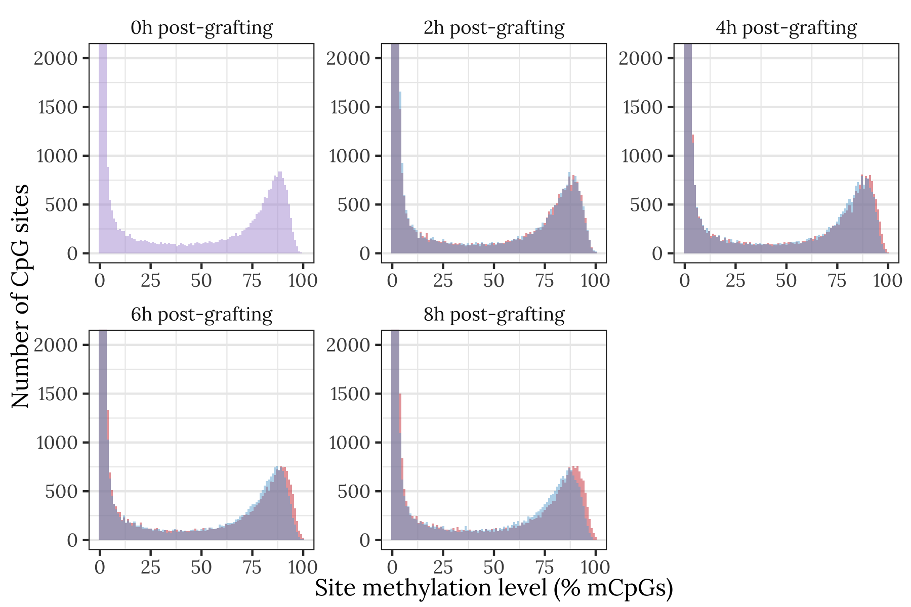

```{r pkgs, results='hide', message=FALSE, warning=FALSE}
# All but 1 of these packages can be easily installed from CRAN or Bioconductor
# However it was slightly harder to install the showtext package. On Mac, I did this:
# installed 'homebrew' using Terminal: ruby -e "$(curl -fsSL https://raw.githubusercontent.com/Homebrew/install/master/install)" 
# installed 'libpng' using Terminal: brew install libpng
# installed 'showtext' in R using: devtools::install_github("yixuan/showtext")  
library(showtext)
library(tidyverse)
library(mice) # for imputation
library(WGCNA)
library(DBI)
library(dbplyr)
library(RSQLite)
library(ecodist)
library(ggrepel)
library(gridExtra)
library(RColorBrewer)
library(pheatmap)
library(glue)
library(vroom)
library(mgcv)
library(MuMIn)
library(brms)
library(ggbeeswarm)
library(bayestestR)
library(glue)
library(future)
library(future.apply)
library(kableExtra)
library(UpSetR)
library(pander)
library(DT)
library(ggridges)
library(gtable)
library(grid)
library(gganimate)
library(magick)
library(sva) # for sva::ComBat
options(stringsAsFactors = FALSE)
library(GenomicFeatures)


setwd("~/Rprojects/Methylation_Apis/")


# set up nice font for figure
nice_font <- "Lora"
font_add_google(name = nice_font, family = nice_font, regular.wt = 400, bold.wt = 700)
showtext_auto()

# define colours
queen_colour <- "#d13b40"
worker_colour <- RColorBrewer::brewer.pal(7, "Blues")[4]

# Database with useful gene name conversion table, GO terms etc.
db <- dbConnect(SQLite(), "data/apis_db.sqlite3") # DBI::dbListTables(db)

# Methylation counts for each site in each sample, output by Claire's BWASP pipeline
by_site <- tbl(db, "methylation_counts") %>%
  mutate(prop = numC / (numC + numT)) %>% 
  left_join(tbl(db, "sample_ids"), by = "sample") %>% 
  left_join(tbl(db, "site_annotations"), by = "site")

# List of sites with at least 2.7% mean methylation, as measured in at least 32 samples (used a lot below)
methylated_sites <- tbl(db, "site_info") %>%
  filter(mean_prop_meth >= 0.027 & n_samples >= 32) %>%
  distinct() %>% pull(site) 
```


## Queen- and worker-destined larvae show diverging methylation frequencies

### Animation showing the shifting distribution

The animation shows the distribution of % methylation for all the sites of the specified type. In all panels, the y-axis is truncated to better display the right tail of the distribution, because the majority of CpG sites have no methylation. To obtain thge data underlying this figure, we ...

One can view the same figure as static plots in the next section. 

```{r make_animation, fig.showtext=TRUE}
if(!file.exists("figures/site_meth_hist/combined_animation.gif")){
  
  make_meth_density_plots <- function(by_site, site_type){
    
    filter_by_site <- function(by_site, site_type){
      if(site_type == "all") return(by_site)
      if(site_type == "exon") by_site <- by_site %>% filter(!is.na(exon_in))
      if(site_type == "intron") by_site <- by_site %>% filter(!is.na(intron_in))
      if(site_type == "promoter") by_site <- by_site %>% filter(!is.na(promoter_of))
      if(site_type == "5UTR") by_site <- by_site %>% filter(!is.na(fiveUTR_in))
      if(site_type == "3UTR") by_site <- by_site %>% filter(!is.na(threeUTR_in))
      if(site_type == "translated") by_site <- by_site %>% filter(translated == 1)
      if(site_type == "intergenic") by_site <- by_site %>% 
          filter(translated != 1 & is.na(exon_in) & is.na(intron_in) & 
                   is.na(promoter_of) & is.na(fiveUTR_in) & is.na(threeUTR_in))
      by_site
    }
    
    if(site_type == "all") title_text <- "All CpG sites"
    if(site_type == "exon") title_text <- "Transcribed regions (exons and UTRs)"
    if(site_type == "translated") title_text <- "Translated regions (exons without UTRs)"
    if(site_type == "intron") title_text <- "Introns"
    if(site_type == "promoter") title_text <- "Promoter regions"
    if(site_type == "5UTR") title_text <- "5' untranslated regions"
    if(site_type == "3UTR") title_text <- "3' untranslated regions"
    if(site_type == "intergenic") title_text <- "Intergenic regions"
    
    
    site_meth_counts <- by_site %>%
      filter_by_site(site_type) %>%
      mutate(coverage = numC + numT) %>%
      dplyr::select(site, sample, numC, coverage, caste, time) %>%
      group_by(caste, time, site) %>% # combine over the 4 replicate samples...
      summarise(prop_meth = sum(numC) / sum(coverage), .groups = "drop") %>% 
      dplyr::select(caste, time, prop_meth) %>%
      collect(n = Inf) %>% 
      mutate(caste = replace(caste, caste =="t", "Time 0"),
             caste = factor(caste, c("Time 0", "Queen", "Worker"))) 
    
    n_bins <- 101
    ylim_max <- 1.4 * max(hist(site_meth_counts$prop_meth[site_meth_counts$time==8] * 100, 
                               plot = FALSE, breaks = n_bins)$counts[80:99])
    
    animated_plot <- site_meth_counts %>%
      mutate(time = factor(time, c(0, 2, 4, 6, 8))) %>%
      ggplot(aes(x = 100 * prop_meth, fill = caste, group = time)) +
      geom_histogram(data = site_meth_counts %>% filter(caste == "Time 0"), 
                     fill = "#b19cd9",
                     alpha = 0.5, bins = n_bins,position = "dodge") +
      geom_histogram(data = site_meth_counts %>% filter(caste == "Queen"), 
                     fill = queen_colour,
                     alpha = 0.5, bins = n_bins, position = "dodge") +
      geom_histogram(data = site_meth_counts %>% filter(caste == "Worker"), 
                     fill = worker_colour,
                     alpha = 0.5, bins = n_bins, position = "dodge") +
      coord_cartesian(ylim = c(0, ylim_max)) +
      labs(title = title_text,
           subtitle = "{closest_state}h post-grafting", 
           x = "Site methylation level (% mCpGs)", 
           y = "Number of CpG sites") +
      theme_bw() + 
      theme(legend.position = "none", 
            text = element_text(family = nice_font),
            strip.background = element_blank(),
            panel.grid.major.x = element_blank()) + 
      transition_states(time, transition_length = 0.1, state_length = 0.1) +
      ease_aes('sine-in-out') +
      enter_fade() +
      exit_fade()
    
    anim_save(filename = glue("figures/site_meth_hist/{site_type}_animation.gif"), 
              animate(animated_plot, height = 5, width = 5, units = "in", res = 150))
    
    static_plot <- site_meth_counts %>%
      ggplot(aes(x = 100 * prop_meth, fill = caste)) +
      geom_histogram(data = site_meth_counts %>% 
                       filter(caste == "Time 0"), fill = "#b19cd9",
                     alpha = 0.5, bins = n_bins, position = "dodge") +
      geom_histogram(data = site_meth_counts %>% 
                       filter(caste == "Queen"), fill = queen_colour,
                     alpha = 0.5, bins = n_bins, position = "dodge") +
      geom_histogram(data = site_meth_counts %>% 
                       filter(caste == "Worker"), fill = worker_colour,
                     alpha = 0.5, bins = n_bins,position = "dodge") +
      facet_wrap(~ paste(time, "h post-grafting", sep = ""), scale = "free") +
      scale_fill_manual(values = c("#b19cd9", queen_colour, worker_colour)) +
      coord_cartesian(ylim = c(0, ylim_max)) +
      theme_bw() + 
      theme(legend.position = "none", 
            text = element_text(family = nice_font),
            strip.background = element_blank(),
            panel.grid.major.x = element_blank()) + 
      xlab("Site methylation level\n(% mCpGs; sites with <5% mCpGs excluded)") +
      ylab("Number of CpG sites")
    
    ggsave(glue("figures/site_meth_hist/{site_type}_plot.png"), 
           static_plot, width = 6, height = 4)

    ggsave(glue("figures/site_meth_hist/{site_type}_plot.pdf"), 
           static_plot, width = 6, height = 4)
  }
  
  # Make the individual gif panels
  make_meth_density_plots(by_site, "translated")
  make_meth_density_plots(by_site, "intron")
  make_meth_density_plots(by_site, "promoter")
  make_meth_density_plots(by_site, "5UTR")
  make_meth_density_plots(by_site, "3UTR")
  make_meth_density_plots(by_site, "intergenic")
  promoter_gif <- image_read("figures/site_meth_hist/promoter_animation.gif")
  translated_gif <- image_read("figures/site_meth_hist/translated_animation.gif")
  intron_gif <- image_read("figures/site_meth_hist/intron_animation.gif")
  fiveUTR_gif <- image_read("figures/site_meth_hist/5UTR_animation.gif")
  threeUTR_gif <- image_read("figures/site_meth_hist/3UTR_animation.gif")
  intergenic_gif <- image_read("figures/site_meth_hist/intergenic_animation.gif")
  
  # Make the top panel of the animation
  d <- image_blank(750 * 3, 750)
  the_frame <- d
  for(i in 2:100) the_frame <- c(the_frame, d)
  new_gif <- image_append(c(translated_gif[1], promoter_gif[1], intron_gif[1]))
  
  for(i in 2:100){
    combined <- image_append(c(translated_gif[i], promoter_gif[i], intron_gif[i]))
    new_gif <- c(new_gif, combined)
  }
  anim_save(new_gif, filename = "figures/site_meth_hist/combined_animation_top.gif")
  
  # Make bottom panel
  d <- image_blank(750*3, 750)
  the_frame <- d
  for(i in 2:100) the_frame <- c(the_frame, d)
  new_gif <- image_append(c(fiveUTR_gif[1], threeUTR_gif[1], intergenic_gif[1]))
  
  for(i in 2:100){
    combined <- image_append(c(fiveUTR_gif[i], threeUTR_gif[i], intergenic_gif[i]))
    new_gif <- c(new_gif, combined)
  }
  anim_save(new_gif, filename = "figures/site_meth_hist/combined_animation_bottom.gif")
  
  # Combine the top and bottom
  top_gif <- image_read("figures/site_meth_hist/combined_animation_top.gif")
  bottom_gif <- image_read("figures/site_meth_hist/combined_animation_bottom.gif")
  d <- image_blank(750*3, 750*2)
  the_frame <- d
  for(i in 2:100) the_frame <- c(the_frame, d)
  
  new_gif <- image_append(c(top_gif[1], bottom_gif[1]), stack = TRUE)
  
  for(i in 2:100){
    combined <- image_append(c(top_gif[i], bottom_gif[i]), stack = TRUE)
    new_gif <- c(new_gif, combined)
  }
  
  anim_save(new_gif, filename = "figures/site_meth_hist/combined_animation.gif")
  
  unlink("figures/site_meth_hist/promoter_animation.gif")
  unlink("figures/site_meth_hist/translated_animation.gif")
  unlink("figures/site_meth_hist/intron_animation.gif")
  unlink("figures/site_meth_hist/5UTR_animation.gif")
  unlink("figures/site_meth_hist/3UTR_animation.gif")
  unlink("figures/site_meth_hist/intergenic_animation.gif")
  unlink("figures/site_meth_hist/combined_animation_top.gif")
  unlink("figures/site_meth_hist/combined_animation_bottom.gif")
}
```


### Static figures equivalent to the animation {.tabset}

#### Translated regions (exons, excluding UTRs)

<!-- Fix these by changing to raw github links -->


#### Promoter regions


#### Introns


#### 5'-UTRs


#### 3'-UTRs


#### Intergenic regions


## Genomic context of sites with caste-specific methylation {.tabset}

The following plots show estimates of the average difference in methylation between castes (within a timepoint) or timepoints (within a caste). These plots use the output of the BWASP pipelinee, which (among other things) uses the `methylkit` package to estimate the difference in % methylated cytosines at a given site between two groups of samples. This difference in % methylated cytosines is the (unstandardised) effect size. We then used a linear model to estimate the average effect size for sites of each genomic context privded in the .gff file of genome annotations (e.g. exons, introns, UTRs). This was accomplished by running a linear model with the following formula:

$$y_i = \alpha + \beta_1x_{1i} + \beta_1x_{2i} + \beta_1x_{3i} + \beta_1x_{4i} + \beta_1x_{5i} + \epsilon_i$$
Here, $y_i$ is the effect size for site $i$, $\alpha$ is the global intercept, the five $\beta$ terms are regression coefficients to be estimated, the five $x_i$ terms are binary predictor variables for site $i$, and $\epsilon_i$ is the residual (assumed to be sampled from a Normal distribution with mean zero). The five binary predictor variables describe whether the focal site is (or is not) in a coding region, a promoter, an intron, a 5'-UTR, or a 3'-UTR (note that sites can be overlap more than one of these). Promoter regions were defined as regions that are within 2000bb upstream or 200bp downstream of a gene. After fitting the model, we then used the estimated regression coefficients to find the estimated average effect size for sites that mapped uniquely to each of the five genomic features. One model was run for each comparison point (i.e. each panel in the figures below).


### Comparing queen- and worker-destined larvae

```{r site_type_plots, message=FALSE, warning=FALSE, fig.width=4.6}
get_bwasp_sites <- function(p_cutoff, q_cutoff, site_list = NULL){
  
  df <- list.files("data/BWASP_results/sites", 
             full.names = TRUE, recursive = TRUE) %>%
    map_df(~ read_tsv(.x) %>% # filter by p and q
             filter(pvalue < p_cutoff & qvalue < q_cutoff)) %>% 
    left_join(tbl(db, "site_info") %>%
                dplyr::select(site, seqnames, start) %>% collect(), 
              by = c("seqnames", "start")) 
  
  # optionally, filter out sites not in site_list
  if(!is.null(site_list)) df <- df %>% filter(site %in% site_list)
  
  df %>%
    full_join(tbl(db, "site_annotations") %>% collect()) %>%
    arrange(qvalue) %>% as.data.frame() %>%
    left_join(tbl(db, "gene_names") %>% 
                dplyr::select(gene_symbol, gene_name) %>% collect(), 
              by = c("exon_in" = "gene_symbol")) %>%
    dplyr::rename(exon_gene_name = gene_name) %>%
    left_join(tbl(db, "gene_names") %>% 
                dplyr::select(gene_symbol, gene_name) %>% collect(), 
              by = c("intron_in" = "gene_symbol")) %>%
    dplyr::rename(intron_gene_name = gene_name) %>%
    left_join(tbl(db, "gene_names") %>% 
                dplyr::select(gene_symbol, gene_name) %>% collect(), 
              by = c("promoter_of" = "gene_symbol")) %>%
    dplyr::rename(promoter_gene_name = gene_name) %>%
    left_join(tbl(db, "gene_names") %>% 
                dplyr::select(gene_symbol, gene_name) %>% collect(), 
              by = c("fiveUTR_in" = "gene_symbol")) %>%
    dplyr::rename(fiveUTR_gene_name = gene_name) %>%
    left_join(tbl(db, "gene_names") %>% 
                dplyr::select(gene_symbol, gene_name) %>% collect(), 
              by = c("threeUTR_in" = "gene_symbol")) %>%
    dplyr::rename(threeUTR_gene_name = gene_name) %>%
    filter(!is.na(seqnames)) %>%
    dplyr::select(site, everything()) %>%
    as_tibble()
}

plotting_data <- get_bwasp_sites(p = 1, q = 1, 
                site_list = methylated_sites) %>%
  mutate(in_exon = !is.na(exon_in),
         in_promoter = !is.na(promoter_of),
         in_intron = !is.na(intron_in),
         in_5UTR = !is.na(fiveUTR_in),
         in_3UTR = !is.na(threeUTR_in),
         in_coding_region = translated == 1) %>% 
  filter(!is.na(in_coding_region)) %>%
  dplyr::select(comparison, starts_with("in_"), meth.diff, pvalue, qvalue) 


make_lm_estimates <- function(comp){
  
  if(str_detect(comp, "queen") & str_detect(comp, "worker")) {
    facet_label <- paste("Caste difference (", str_extract(comp, "[2468]"), "h)", sep = "")
    plotting_data <- plotting_data %>% 
      mutate(meth.diff = meth.diff * -1) %>%
      filter(comparison == comp) 
    
  }
  if(str_detect(comp, "queen") & !str_detect(comp, "worker")) {
    facet_label <- paste("Queens: ", paste0(str_extract_all(comp, "[02468]")[[1]], collapse = " vs "), "h", sep = "")
    plotting_data <- plotting_data %>% 
      filter(comparison == comp)
  }
  if(!str_detect(comp, "queen") & str_detect(comp, "worker")) {
    facet_label <- paste("Workers: ", paste0(str_extract_all(comp, "[02468]")[[1]], collapse = " vs "), "h", sep = "")
    plotting_data <- plotting_data %>% 
      filter(comparison == comp)
  }

  model <- lm(meth.diff ~ in_coding_region + in_promoter + in_intron + in_5UTR + in_3UTR, 
              data =  plotting_data)
  
  new <- expand_grid(in_coding_region = c(TRUE, FALSE), 
                     in_promoter = c(TRUE, FALSE), 
                     in_intron = c(TRUE, FALSE), 
                     in_5UTR = c(TRUE, FALSE), 
                     in_3UTR = c(TRUE, FALSE)) 
  new <- new[rowSums(new) %in% 0:1, ]
    data.frame(new, mean_meth_diff = predict(model, newdata = new, se.fit = TRUE)) %>%
    mutate(region = c("Coding region", "Promoters", "Introns", "5'-UTR", "3'-UTR", "Intergenic"),
           region = factor(region, rev(unique(region))),
           comparison = facet_label) 
}

plot_lm_estimates <- function(lm_estimates, xl){
  lm_estimates %>%
    ggplot(aes(region, mean_meth_diff.fit)) + 
    geom_errorbar(aes(ymin = mean_meth_diff.fit - mean_meth_diff.se.fit*1.96,
                      ymax = mean_meth_diff.fit + mean_meth_diff.se.fit*1.96), width = 0) + 
    geom_hline(yintercept = 0, linetype = 2) + 
    geom_point() + 
    coord_flip() + 
    facet_wrap(~ comparison) + xlab(NULL) + ylab(NULL) + 
    theme_bw() + 
    ylab(xl) + xlab("Genomic region") +
    theme(
     # text = element_text(family = nice_font),
      strip.background = element_blank()
    )
}


caste_plots <- tibble(comp = sort(unique(plotting_data$comparison))) %>%
  filter(str_detect(comp, "queen") & str_detect(comp, "worker")) %>%
  pull(comp) %>% 
  map_df(make_lm_estimates) %>% 
  plot_lm_estimates("Mean \u00B1 SE difference in % methylation\n(positive means Queens > Workers)")

timeQ_plots <- tibble(comp = sort(unique(plotting_data$comparison))) %>%
  filter(str_detect(comp, "queen") & !str_detect(comp, "worker")) %>%
  pull(comp) %>% 
  map_df(make_lm_estimates) %>% 
  plot_lm_estimates("Mean \u00B1 SE difference in % methylation\n(positive means methylation increases with time)")

timeW_plots <- tibble(comp = sort(unique(plotting_data$comparison))) %>%
  filter(!str_detect(comp, "queen") & str_detect(comp, "worker")) %>%
  pull(comp) %>% 
  map_df(make_lm_estimates) %>% 
  plot_lm_estimates("Mean \u00B1 SE difference in % methylation\n(positive means methylation increases with time)")

caste_plots
```

### Comparing queen-destined larvae across timepoints
```{r fig.width=6.3}
timeQ_plots
```

### Comparing worker-destined larvae across timepoints
```{r fig.width=6.3}
timeW_plots
```


## Results of the BWASP differential methylation pipeline

The following sections show the results of statistical tests using the BWASP pipeline. The table shows a list of sites or 500bp genomic windows that were statistically significantly differentially methylated (using Fisher Exact tests implemented via `methylKit::calculateDiffMeth`). Using BWASP, we specified a series of pre-planned comparions (contrasts) to compare the methylation levels at each site A) between castes witin each time point (e.g. queen vs worker samples at 8h), and B) between time points within each caste (e.g. 2h vs 8h within the queen samples). The three tables in each section show sites/windows that were significantly differenetially methylated between castes (at a given time point), or between time points (within each caste).

We caution that the Fisher Exact test approach is under-powered because it ignores the rest of the data when estimating each effect size. For example, to test for differential methylation in the '2h vs 6h queen' comparison, the test ignores all data from worker samples, or from the other time points in queens, which does not fully utilise the information in the dataset. The Fisher Exact test appraoch is also problematic because we have to run 24 separate hypothesis tests for each site (to calculate each of the 24 pairwise comparisons we examined), instead of running one model per site as in the generalised additive models presented below. The p-values below are corrected using the qvalue method (`?qvalue::qvalue`) within each comparison, and we identified candidate differentially methylated sites as those for which the q-value was <0.05 (or <0.01, in one case where tens of thousands of sites had qvalues just under 0.05).

Despite the issues with the Fisher Exact test approach, we include it to facilitate comparison with earlier work. 


### List of significantly differentially methylated **sites** (DMSs) from BWASP 

#### Caste-specific methylation

```{r bwasp_results, message=FALSE, warning=FALSE}
# Note that in the output of BWASP, a positive meth.diff value in comparison "A.vs.B" means that 
# the B methylation percentage is higher than the A methylation percentage. In one case we flip the sign for clarity.

# Get significant sites. 'Significant' means both p and q < 0.05
bwasp_sites <- get_bwasp_sites(0.05, 0.05)

between_castes <- bwasp_sites %>%
  filter(str_detect(comparison, "queen") & str_detect(comparison, "worker")) %>%
  dplyr::select(site, seqnames, start, comparison, meth.diff, pvalue, qvalue, 
                exon_gene_name, intron_gene_name, promoter_gene_name) %>%
  arrange(pvalue) %>%
  mutate(meth.diff = -1 * meth.diff, # flip the sign for caste comparison so that positive means Q>W
         pvalue = round(-1 * log10(pvalue), 1)) %>%
  dplyr::rename(`Diff. in % methylation (postive means Q>W)` = meth.diff,
                `-log10 pvalue` = pvalue)

temporal_change_queens <- bwasp_sites %>%
  filter(str_detect(comparison, "queen") & !str_detect(comparison, "worker")) %>%
  dplyr::select(site, seqnames, start, comparison, meth.diff, pvalue, 
                qvalue, exon_gene_name, intron_gene_name, promoter_gene_name) %>%
  arrange(pvalue)  %>%
  mutate(pvalue = round(-1 * log10(pvalue), 1)) %>%
  dplyr::rename(`Diff. in % methylation (postive means increase over time)` = meth.diff,
                `-log10 pvalue` = pvalue)

temporal_change_workers <- bwasp_sites %>%
  filter(!str_detect(comparison, "queen") & str_detect(comparison, "worker")) %>%
  dplyr::select(site, seqnames, start, comparison, meth.diff, pvalue, 
                qvalue, exon_gene_name, intron_gene_name, promoter_gene_name) %>%
  arrange(pvalue) %>%
  mutate(pvalue = round(-1 * log10(pvalue), 1)) %>%
  dplyr::rename(`Diff. in % methylation (postive means increase over time)` = meth.diff,
                `-log10 pvalue` = pvalue)

# Save list of BWASP sig genes for "Compare expr + meth.Rmd"
list(
  bwasp_caste_sig_genes = unname(unlist(
    dplyr::select(between_castes, ends_with("_gene_name")))) %>% 
    unique() %>% na.omit %>% as.character(),
  bwasp_timeQ_sig_genes = unname(unlist(
    dplyr::select(temporal_change_queens, ends_with("_gene_name")))) %>% 
    unique() %>% na.omit %>% as.character(),
  bwasp_timeW_sig_genes = unname(unlist(
    dplyr::select(temporal_change_workers %>% filter(qvalue < 0.01), 
                  ends_with("_gene_name")))) %>% 
    unique() %>% na.omit %>% as.character()
) %>% saveRDS("output/bwasp_sig_genes.rds")


# my_data_table <- function(df){
#   datatable(df, rownames = FALSE, fillContainer = TRUE, #filter = 'top', 
#             extensions = 'Buttons', height = 10,
#             options = list(
#               dom = 'Bfrtip', pageLength = 10,
#               buttons = c('copy', 'csv', 'excel', 'pdf')))
# } 

my_data_table <- function(df){
  datatable(
    df, rownames=FALSE,
    autoHideNavigation = TRUE,
    extensions = c("Scroller",  "Buttons"),
    options = list(
      dom = 'Bfrtip',
      deferRender=TRUE,
      scrollX=TRUE, scrollY=400,
      scrollCollapse=TRUE,
      buttons = 
        list('pageLength', 'colvis', 'csv', list(
          extend = 'pdf',
          pageSize = 'A4',
          orientation = 'landscape',
          filename = 'Apis_methylation')),
        pageLength = 50
        )
    )
}


between_castes %>% dplyr::select(-site) %>% 
  mutate(comparison = str_replace(comparison, "queen", "Q"),
         comparison = str_replace(comparison, "worker", "W"),
         comparison = str_replace_all(comparison, "[.]", " ")) %>%
  my_data_table()
```
**Table XX:** The table shows the `r length(na.omit(unique(between_castes$site)))` sites for which BWASP reported a significant difference in methylation between queens and workers at one or more time points. Other columns give statistical results and annotations for the focal site. Sites were recorded as statistically significant if both their $p$ and $q$ values were <0.05.

#### Temporally varying methylation (queens)

```{r message=FALSE, warning=FALSE}
temporal_change_queens %>% dplyr::select(-site) %>% 
  mutate(comparison = str_replace_all(comparison, "queen", "Q"),
         comparison = str_replace_all(comparison, "[.]", " ")) %>% 
  my_data_table()
```
**Table XX:** The table shows the `r length(na.omit(unique(temporal_change_queens$site)))` sites for which BWASP reported a significant difference in methylation between time points in queen-destined larvae. Other columns give statistical results and annotations for the focal site. Sites were recorded as statistically significant if both their $p$ and $q$ values were <0.05.

#### Temporally varying methylation (workers)

```{r echo=FALSE, message=FALSE, warning=FALSE}
n_somewhat_sig <- temporal_change_workers %>% 
  filter(qvalue < 0.05) %>% pull(site) %>%
  na.omit() %>% length()

n_extra_sig <- temporal_change_workers %>% 
  filter(qvalue < 0.01) %>% pull(site) %>%
  na.omit() %>% length()
```


Note: if we use the same cutoff as before, i.e. p < 0.05 and q < 0.05, there would be `r n_somewhat_sig` significant sites in this table. We therefore switched to $q$ < 0.01 for this table, yielding a more manageable number of sites to display.
```{r message=FALSE, warning=FALSE}
temporal_change_workers %>% dplyr::select(-site) %>% 
  mutate(comparison = str_replace_all(comparison, "worker", "W"),
         comparison = str_replace_all(comparison, "[.]", " ")) %>%
  filter(qvalue < 0.01) %>%
  my_data_table()
```
**Table XX:** The table shows the `r n_extra_sig` sites for which BWASP reported a significant difference in methylation between time points in queen-destined larvae. Other columns give statistical results and annotations for the focal site. Sites were recorded as statistically significant if both their $p$ and $q$ values were <0.01 (note: this is lower than for the previous two tables; there would be `r n_somewhat_sig` sites if we used the same 0.05 cutoff for significance).


### List of significantly differentially methylated **500bp windows** (DMWs) from BWASP

#### Caste-specific methylation

```{r BWASP_Venn, message=FALSE, warning=FALSE}
source("code/add_gene_exon_columns.R")
q_threshold <- 0.01

window_500bp_caste <- 
  list.files("data/BWASP_results/500bp_windows/Caste specific results", full.names = TRUE) %>%
  map_df(read_tsv) %>% 
  filter(pvalue < 0.05 & qvalue < q_threshold) %>% 
  mutate(pvalue = round(pvalue, 4), qvalue = round(qvalue, 4)) 
window_500bp_caste <- window_500bp_caste %>%
  full_join(window_500bp_caste %>% 
              filter(qvalue < q_threshold ) %>% 
              dplyr::select(seqnames, start, end) %>% distinct() %>%
              add_gene_exon_columns() %>% distinct(), 
            by = c("seqnames", "start", "end")) %>%
  left_join(tbl(db, "gene_names") %>% dplyr::select(gene_symbol, gene_name) %>% collect(), 
            by = c("exon_in" = "gene_symbol")) %>%
  dplyr::select(-width, -strand) %>% distinct() %>%
  mutate(meth.diff = -1 * meth.diff) %>%
  dplyr::rename(`Diff. in % methylation (postive means Q>W)` = meth.diff) 


window_500bp_timeQ <- 
  list.files("data/BWASP_results/500bp_windows/Temporal_Q", full.names = TRUE) %>%
  map_df(read_tsv) %>% 
  filter(pvalue < 0.05 & qvalue < q_threshold) %>% 
  mutate(pvalue = round(pvalue, 4), qvalue = round(qvalue, 4)) 
window_500bp_timeQ <- window_500bp_timeQ %>%
  full_join(window_500bp_caste %>% 
              filter(qvalue < q_threshold ) %>% 
              dplyr::select(seqnames, start, end) %>% distinct() %>%
              add_gene_exon_columns() %>% distinct(), by = c("seqnames", "start", "end")) %>%
  left_join(tbl(db, "gene_names") %>% dplyr::select(gene_symbol, gene_name) %>% collect(), 
            by = c("exon_in" = "gene_symbol")) %>%
  dplyr::select(-width, -strand) %>% distinct() %>%
  dplyr::rename(`Diff. in % methylation (postive means increase over time)` = meth.diff)

window_500bp_timeW <- 
  list.files("data/BWASP_results/500bp_windows/Temporal_W", full.names = TRUE) %>%
  map_df(read_tsv) %>% 
  filter(pvalue < 0.05 & qvalue < q_threshold) %>% 
  mutate(pvalue = round(pvalue, 4), qvalue = round(qvalue, 4)) 
window_500bp_timeW <- window_500bp_timeW %>%
  full_join(window_500bp_caste %>% 
              filter(qvalue < q_threshold ) %>% 
              dplyr::select(seqnames, start, end) %>% distinct() %>%
              add_gene_exon_columns() %>% distinct(), by = c("seqnames", "start", "end")) %>%
  left_join(tbl(db, "gene_names") %>% dplyr::select(gene_symbol, gene_name) %>% collect(), 
            by = c("exon_in" = "gene_symbol")) %>%
  dplyr::select(-width, -strand) %>% distinct() %>%
  dplyr::rename(`Diff. in % methylation (postive means increase over time)` = meth.diff)

window_500bp_caste %>%
  mutate(comparison = str_replace(comparison, "queen", "Q"),
         comparison = str_replace(comparison, "worker", "W"),
         comparison = str_replace_all(comparison, "[.]", " ")) %>%
  my_data_table()
```

```{r echo=FALSE}
n_caste_windows <- window_500bp_caste %>% dplyr::select(seqnames, start, end) %>% distinct() %>% nrow()
n_queen_windows <- window_500bp_timeQ %>% dplyr::select(seqnames, start, end) %>% distinct() %>% nrow()
n_worker_windows <- window_500bp_timeW %>% dplyr::select(seqnames, start, end) %>% distinct() %>% nrow()
```


**Table XX:** The table shows the `r n_caste_windows` 500bp windows in which BWASP detected a significant difference in methylation between queens and workers at one or more time points. 


#### Temporally varying methylation (queens)
```{r message=FALSE, warning=FALSE}
window_500bp_timeQ %>%
  mutate(comparison = str_replace_all(comparison, "queen", "Q"),
         comparison = str_replace_all(comparison, "[.]", " ")) %>% 
  my_data_table()
```
**Table XX:** The table shows the `r n_queen_windows` 500bp windows in which BWASP detected a significant change in methylation with time, in queen-destined larvae.

#### Temporally varying methylation (workers)
```{r message=FALSE, warning=FALSE}
window_500bp_timeW %>%
  mutate(comparison = str_replace_all(comparison, "worker", "W"),
         comparison = str_replace_all(comparison, "[.]", " ")) %>% 
  my_data_table()
```
**Table XX:** The table shows the `r n_worker_windows` 500bp windows in which BWASP detected a significant change in methylation with time, in worker-destined larvae.


## Run Bayesian GAMs on the methylome data

### Count the number of sites before and after QC

We first remove sites with methylation levels too low for analysis, or which were measured in too few samples, and count up the number of sites suitable for analysis.

The bisulphite conversion rate was about 99.73 (as measured by the apparent % methylation of sites in the phage lambda DNA), so we expect unmethylated sites to appear methylated about 0.27% of the time. To ensure we focus on sites where these 'false positive' signals of methylation provide only a modest portion of the observed % of Cs vs Ts (i.e. the estimate of % methylation), we chose to focus on sites that have 10$\times$ higher methylation rates than expected based on the low-level background 'noise'. That is, we excluded all sites where fewer than 2.7% of the reads were Cs (i.e. putatively methylated). This rules out the great majority of sites for which at least one C was observed. We also discarded sites that had been measured in fewer than 32 of our 36 samples.

#### Total number of sites with sufficient data for the GAMs:

```{r}
methylated_sites %>% length()
```


### Run preliminary frequentist GAMs using `mgcv::gam`

There are too many sites to run our preferred Bayesian model on all of them in a reasonable amount of time. We therefore first use a model selection approach using the equivalent frequentist generalised additive model (GAMs; implemented in the `mgcv` package, which runs a similar model in <1 second) to select a set of sites that appear to show a caste difference in the frequency of methylation, which we then re-analyse using the slower (but more principled and information-rich) Bayesian approach. To summarise the following code: 

- The frequentist analysis uses all samples except the time zero samples, since these are complicated to model correctly because they do not neatly belong to either the queen- or worker-destined treatments
- `Time` is modelled using a thin plate regression spline (see `?mgcv::s`), allowing non-linear changes in % methylation with time, with the amount of non-linearity being driven by the data. 
- For each site, we fit 5 different models and then compare them using the corrected Akaike Information Criterion (AICc). The 5 models fitted included the following fixed effects: 1) neither caste nor time (our 'null model'), 2) caste, 3) time, 4) both caste and time, or 5) caste, time, and their interaction (the 'full model'). Additionally, all these models contained the experimental replicate as a fixed effect. 
- The formula of the full model was therefore same as for the Bayesian models run below, i.e. `caste + s(time, by = caste, k = 4) + rep`.
- The response variable was the number of cytosines observed at the site, given the total coverage at the sites (i.e. number of reads containing Cs plus Ts). We used Binomial errors and a logit link.
- Sites were re-analysed using the Bayesian models if A) the 'variable importance' of caste was at least 99% (indicating that there is >99% chance that caste is present in the top model out of the 5 that were considered), and/or B) the site was statistically significant in the BWASP results mentioned above. 


```{r frequentist_GAMs, message=FALSE}
if(!file.exists("output/list_of_DMS_frequentist_GAM.txt")){
  
  model_multiple_sites <- function(chunk_number, vector_of_chunks){
    
    print("Starting new chunk")
    focal_sites <- vector_of_chunks[[chunk_number]]
    
    # Get data from the database for the focal chunk of sites
    focal_chunk <- by_site %>%  
      filter(site %in% focal_sites & time != 0) %>% 
      dplyr::select(site, numC, numT, caste, time, rep) %>%
      distinct() %>%
      collect() %>%
      mutate(caste = factor(caste, c("Queen", "Worker")),
             rep = C(factor(rep), contr = "contr.sum"))  
    
    # Internal function to model one site using GAM, and compare models by AICc
    do_one_site <- function(focal_site, data_chunk){
      
      focal_site_data <- data_chunk %>%
        filter(site == focal_site)
      
      # Make AIC model comparison table on the 5 candidate models
      tibble(Site = focal_site, 
             Model = c("caste + s(time, by = caste)", 
                       "caste + s(time)", 
                       "caste", 
                       "s(time)", 
                       "Replicate only")) %>%
        bind_cols(
          AICc(gam(cbind(numC, numT) ~ caste + s(time, by = caste, k = 4) + rep, data = focal_site_data, family = "binomial"),
               gam(cbind(numC, numT) ~ caste + s(time,  k = 4) + rep, data = focal_site_data, family = "binomial"),
               gam(cbind(numC, numT) ~ caste + rep, data = focal_site_data, family = "binomial"),
               gam(cbind(numC, numT) ~ s(time,  k = 4) + rep, data = focal_site_data, family = "binomial"),
               gam(cbind(numC, numT) ~ rep, data = focal_site_data, family = "binomial")) %>% as.data.frame() %>% as_tibble()
        ) %>% arrange(AICc) %>% mutate(delta = AICc - AICc[1])
    }
    
    future_lapply(focal_sites, do_one_site, data_chunk = focal_chunk) %>%
      saveRDS(glue("data/meth_sites_GAMs/chunk_{chunk_number}.rds"))
  }
  
  methylated_sites <- split(methylated_sites, ceiling(seq_along(methylated_sites)/1000))
  n_chunks <- length(methylated_sites)
  gam_results <- lapply(1:n_chunks, model_multiple_sites, methylated_sites)
  
  # Calculate AIC weight from delta-AIC values
  # The sum of the weights for all models with a predictor in them gives its "variable importance" 
  get_aic_weight <- function(aic_deltas){
    exp(-0.5 * aic_deltas) / sum(exp(-0.5 * aic_deltas))
  }
  
  caste_importance <- list.files("data/meth_sites_GAMs", full.names = TRUE) %>%
    map_df(readRDS) %>%
    group_by(Site) %>%
    mutate(weight = get_aic_weight(delta)) %>% 
    ungroup() %>%
    filter(Model %in% c("caste", "caste + s(time)", "caste + s(time, by = caste)")) %>%
    group_by(Site) %>%  # sum the weights over the 3 models containining TIME, i.e. "variable importance"
    summarise(caste_importance = sum(weight), .groups = "drop")
  
  time_importance <- list.files("data/meth_sites_GAMs", full.names = TRUE) %>%
    map_df(readRDS) %>%
    group_by(Site) %>%
    mutate(weight = get_aic_weight(delta)) %>% 
    ungroup() %>%
    filter(Model %in% c("s(time)", "caste + s(time)", "caste + s(time, by = caste)")) %>%
    group_by(Site) %>%  # sum the weights over the 3 models containining TIME, i.e. "variable importance"
    summarise(time_importance = sum(weight), .groups = "drop")
  
  interaction_importance <- list.files("data/meth_sites_GAMs", full.names = TRUE) %>%
    map_df(readRDS) %>%
    group_by(Site) %>%
    mutate(weight = get_aic_weight(delta)) %>% 
    ungroup() %>%
    filter(Model == "caste + s(time, by = caste)") %>%
    rename(interaction_importance = weight) %>%
    select(Site, interaction_importance)
  
  importance <- caste_importance %>%
    left_join(time_importance) %>%
    left_join(interaction_importance) %>%
    arrange(-interaction_importance)
  
  write_tsv(importance, "output/list_of_DMS_frequentist_GAM.txt")
} else importance <- read_tsv("output/list_of_DMS_frequentist_GAM.txt")

sig_sites_caste_frequentist_GAM <- importance %>% 
  filter(caste_importance > 0.99) %>% pull(Site)  

sig_sites_caste_bwasp <- between_castes %>%
  dplyr::select(site, seqnames, start) %>% distinct()
sig_sites_caste_bwasp <- sig_sites_caste_bwasp[complete.cases(sig_sites_caste_bwasp), ]

bwasp_seq_names <- sig_sites_caste_bwasp$seqnames %>% unique()
bwasp_start <- sig_sites_caste_bwasp$start %>% unique()
sig_sites_caste_bwasp <- tbl(db, "site_info") %>%
  dplyr::select(site, seqnames, start) %>%
  filter(seqnames %in% bwasp_seq_names) %>%
  filter(start %in% bwasp_start) %>%
  collect() %>%
  mutate(pasted = paste(seqnames, start)) %>%
  filter(pasted %in% paste(bwasp_sites$seqnames, bwasp_sites$start)) %>%
  distinct()

sites_for_bayes_GAM <- unique(c(sig_sites_caste_frequentist_GAM, sig_sites_caste_bwasp$site))
```


### Run the Bayesian GAMs

The previous code chunk identified `r length(sites_for_bayes_GAM)` candidate differentially-methylated sites, which we now analyse using a Bayesian generalised additive model (GAM). The Bayesian approach is more flexible, e.g. it allows us to incorporate the time 0 samples into the analysis, facilitates calculation of 95% credible intervals for metrics of interest, and facilitates regularization of the parameter estimates using so-called 'sceptical' priors (see the book/lecture series _Statistical Rethinking_ by Richard McElreath). 

We first generated multiple copies of the orignal dataset in which the time 0 samples were relabelled as either a queen or worker. We generated all possible combinations of caste labels in which approximately equal numbers of queen and worker labels were applied to the time 0 samples; for example, if there were data on all four t0 samples for the focal site (the typical situation for most of the sites in our post-QC dataset), we relabelled the t0 samples 6 different ways as follows: QQWW, QWQW, QWWQ, WQQW, WQWQ, WWQQ. We then ran a Bayesian GAM on each of these six datasets, and then averaged their parameter estimates by combining their posteriors using the `brm_multiple` function in `brms`. This procedure will tend to push the estimate of % methylation at time zero towards the same value for both castes (which we know _a priori_ must be the case due to our experimental design), by effectively making each t0 sample affect the parameter estimates for both queens and workers (but without duplicating any data, which would falsely inflate the model's precision).

Each model had the same formula, namely:

`Binomial(number_methylated, Coverage) ~ caste + s(time, by = caste, k = 4) + replicate`

That is, the response variable is the number of putatively methylated cytosines observed (i.e. sequencing reads that contain a C rather than a T, in the BiS-seq data) recorded, over a series of $n$ Bernoulli trials where $n$ is the coverage of the site. The model formula contains time as a continuous predictor, and caste, a 2-level factor. The effect of time is modelled using a thin plate spline smoothing term, i.e. this model is a Bayesian generalised additive model (GAM). We allowed for caste-specific changes in methylation over time by including the smoothing term to differ between castes. We used mildly regularising priors for all fixed effects, namely `normal(0, 5)`, which helps to prevent overfitting. Replicate (i.e. the 4 experimental blocks) was treated as a fixed factor.

After running the model, we use the posterior parameter estimates to calculate posterior predictions of the mean % methylation at each point in time (using `fitted.brmsfit()`), in each caste. From these, we can calculate the caste difference in methylation at each time point, and test whether the 95% credible interval of this difference includes zero (implying a significant difference in means). We also calculate the difference between all possible pairs of time points within each caste.

The following runs the models in parallel using `future_lapply`, and we attempt to save time by not recompiling the model between each site. This still takes 1-2 days to run on a medium-spec desktop. This should be run in R (not RStudio) in order to use forking for parallel processing.

```{r bayesian_GAMs}
done_already <- list.files("output/meth_sites_brms") %>% 
  str_extract_all("[0123456789]+") %>% unlist()

site_still_to_do <- sites_for_bayes_GAM[!(sites_for_bayes_GAM %in% done_already)]

if(length(site_still_to_do) > 0){
  
  # Get the focal data, for the first site on our to-do list
  focal_site <- site_still_to_do[1]
  
  # Get data from the database for the focal site
  focal_site_data <- by_site %>%  
    filter(site %in% focal_site) %>% 
    mutate(coverage = numC + numT) %>%
    dplyr::select(site, numC, coverage, caste, time, rep) %>%
    distinct() %>%
    collect() %>%
    mutate(caste = factor(caste, c("Queen", "Worker")),
           rep = C(factor(rep), contr = "contr.sum"))  
  
  # Define the formula for the model
  brms_formula <- bf(numC | trials(coverage) ~ caste + s(time, by = caste, k = 4) + rep)
  
  # count the t0 samples for this site
  n_t0_samples <- focal_site_data %>% 
    filter(time == 0) %>% 
    summarise(n = n()) %>% pull(n)
  
  # Make 'data permutations'
  make_permutations <-  function(focal, n_t0_samples){
    
    t0_indexes <- which(is.na(focal$caste))
    
    if(n_t0_samples == 4) {
      v1 <- focal$caste; v2 <- focal$caste; v3 <- focal$caste
      v4 <- focal$caste; v5 <- focal$caste; v6 <- focal$caste
      v1[t0_indexes] <- c("Queen", "Queen", "Worker", "Worker")
      v2[t0_indexes] <- c("Queen", "Worker", "Queen", "Worker")
      v3[t0_indexes] <- c("Queen", "Worker", "Worker", "Queen")
      v4[t0_indexes] <- c("Worker", "Queen", "Queen", "Worker")
      v5[t0_indexes] <- c("Worker", "Queen", "Worker", "Queen")
      v6[t0_indexes] <- c("Worker", "Worker", "Queen", "Queen")
      data_permutations <- list(
        focal %>% mutate(caste = v1),
        focal %>% mutate(caste = v2),
        focal %>% mutate(caste = v3),
        focal %>% mutate(caste = v4),
        focal %>% mutate(caste = v5),
        focal %>% mutate(caste = v6))
      return(data_permutations)
    }
    
    if(n_t0_samples == 3) {
      v1 <- focal$caste; v2 <- focal$caste; v3 <- focal$caste
      v4 <- focal$caste; v5 <- focal$caste; v6 <- focal$caste
      v1[t0_indexes] <- c("Queen", "Queen", "Worker")
      v2[t0_indexes] <- c("Queen", "Worker", "Queen")
      v3[t0_indexes] <- c("Worker", "Queen", "Queen")
      v4[t0_indexes] <- c("Worker", "Worker", "Queen")
      v5[t0_indexes] <- c("Worker", "Queen", "Worker")
      v6[t0_indexes] <- c("Queen", "Worker", "Worker")
      data_permutations <- list(
        focal %>% mutate(caste = v1),
        focal %>% mutate(caste = v2),
        focal %>% mutate(caste = v3),
        focal %>% mutate(caste = v4),
        focal %>% mutate(caste = v5),
        focal %>% mutate(caste = v6))
      return(data_permutations)
    }
    
    if(n_t0_samples == 2) {
      v1 <- focal$caste; v2 <- focal$caste
      v1[t0_indexes] <- c("Queen", "Worker")
      v2[t0_indexes] <- c("Worker", "Queen")
      data_permutations <- list(
        focal %>% mutate(caste = v1),
        focal %>% mutate(caste = v2))
      return(data_permutations)
    }
    
    if(n_t0_samples == 1) {
      v1 <- focal$caste; v2 <- focal$caste
      v1[t0_indexes] <- "Queen"
      v2[t0_indexes] <- "Worker"
      data_permutations <- list(
        focal %>% mutate(caste = v1),
        focal %>% mutate(caste = v2))
      return(data_permutations)
    }
  }
  data_permutations <- make_permutations(focal = focal_site_data, 
                                         n_t0_samples = n_t0_samples)
  
  # run one model on each relabelled 'permutation' of the data 
  master_brm_model <- brm_multiple(
    brms_formula, 
    iter = 4000, chains = 4, 
    prior = prior(normal(0, 5), class = "b"), 
    data = data_permutations, family = "binomial",
    control = list(adapt_delta = 0.99))
  
  plan("multiprocess")
  
  if(length(site_still_to_do) > 0){
    site_still_to_do %>%
      future_lapply(function(focal_site) {
        
        focal <- by_site %>%  
          filter(site == focal_site) %>% 
          mutate(coverage = numC + numT) %>%
          dplyr::select(numC, coverage, caste, time, rep) %>%
          distinct() %>%
          collect() %>%
          mutate(caste = factor(caste, c("Queen", "Worker")))  # sets t0 caste to NA
        
        # count the t0 samples for this site
        n_t0_samples <- focal %>% 
          filter(time == 0) %>% 
          summarise(n = n()) %>% pull(n)
        
        # Set up the data for the focal site
        data_permutations <- make_permutations(focal = focal, n_t0_samples = n_t0_samples)
        
        # Run the model on the focal data
        brm_model <- update(master_brm_model, newdata = data_permutations, recompile = FALSE)
        
        # Get model predictions for plotting:
        time_range <- range(focal$time)
        new <- expand_grid(time = seq(time_range[1], time_range[2], by = 0.2),
                           caste = c("Queen", "Worker"),
                           rep = focal$rep %>% table() %>% which.max() %>% names(),
                           coverage = 100) %>%
          mutate(key = paste("V", 1:n(), sep = ""))
        
        preds <- fitted(brm_model, newdata = new, summary = FALSE) %>% 
          as.data.frame() %>% mutate(draw = 1:n()) %>% 
          gather(key, percent_meth, -draw) %>% 
          left_join(new, by = "key") %>% 
          group_by(caste, time, draw) %>% # average over the <=4 reps
          summarise(percent_meth = mean(percent_meth)) %>%
          as_tibble()
        
        # Caste difference in means (and the LOR) at each time point:
        caste_diff_means <- preds %>% 
          filter(time %in% seq(time_range[1], time_range[2], by = 2)) %>%
          spread(caste, percent_meth) %>%
          mutate(diff = Queen - Worker,
                 queen_odds = (Queen/100) / (1 - (Queen/100)),
                 worker_odds = (Worker/100) / (1 - (Worker/100)),
                 LOR = log(queen_odds / worker_odds)) 
        
        # Find LOR as well (just for the queen-worker difference)
        LOR <- caste_diff_means %>%
          group_by(time) %>%
          summarise(as_tibble(posterior_summary(LOR)),
                    p = min(c(sum(LOR>0) / n(), sum(LOR<0) / n())),
                    .groups = "drop") %>%
          dplyr::rename(LOR = Estimate, LOR_err = Est.Error, 
                        LOR_lower = Q2.5, LOR_upper = Q97.5)
        
        caste_diff_means <- caste_diff_means %>%
          group_by(time) %>%
          summarise(as_tibble(posterior_summary(diff)),
                    p = min(c(sum(diff>0) / n(), sum(diff<0) / n())), # p_direction
                    .groups = "drop") %>%
          dplyr::rename(`Q-W_difference_percent_meth` = Estimate,
                        diff_err = Est.Error)
        
        caste_diff_means <- tibble(
          caste_diff_means[,1:5],
          LOR[,2:6])
        
        # Save the main fit lines for the plots (posterior median):
        means_lines <- preds %>% 
          group_by(caste, time) %>% 
          summarise(percent_meth = median(percent_meth), .groups = "drop")
        
        # Save a random 100 posterior samples for the thin lines on the plots:
        sampled_draws <- sample(max(preds$draw), 100)
        preds <- preds %>% filter(draw %in% sampled_draws)
        
        
        # Also, find the difference in means between time points within each caste:
        time_diff_means <- preds %>% 
          filter(time %in% seq(time_range[1], time_range[2], by = 2)) %>%
          spread(time, percent_meth) %>%
          rename_all(~ paste("t", .x, sep = "")) %>%
          rename(Caste = tcaste, Draw = tdraw) 
        
        if(!("t0" %in% names(time_diff_means))) time_diff_means$t0 <- NA
        if(!("t2" %in% names(time_diff_means))) time_diff_means$t2 <- NA
        if(!("t4" %in% names(time_diff_means))) time_diff_means$t4 <- NA
        if(!("t6" %in% names(time_diff_means))) time_diff_means$t6 <- NA
        if(!("t8" %in% names(time_diff_means))) time_diff_means$t8 <- NA
        
        time_diff_means <- time_diff_means %>%
          mutate(diff_20 = t2 - t0,
                 diff_40 = t4 - t0,
                 diff_60 = t6 - t0,
                 diff_80 = t8 - t0,
                 diff_42 = t4 - t2,
                 diff_62 = t6 - t2,
                 diff_82 = t8 - t2,
                 diff_64 = t6 - t4,
                 diff_84 = t8 - t4,
                 diff_86 = t8 - t6) 
        
        time_comparison_summary <- function(col_name){
          
          time_diff_means$xx <- time_diff_means[, names(time_diff_means) == col_name ]
          time_diff_means %>%
            group_by(Caste) %>%
            summarise(as_tibble(posterior_summary(xx)),
                      p = min(c(sum(xx>0) / n(), sum(xx<0) / n())), # p_direction
                      .groups = "drop") %>%
            mutate(Time = paste0(strsplit((str_extract(col_name, "[02468]+")), 
                                          split = "")[[1]], collapse="vs")) %>%
            select(Caste, Time, everything())
        }
        
        time_diff_means <- bind_rows(
          time_comparison_summary("diff_20"),
          time_comparison_summary("diff_40"),
          time_comparison_summary("diff_60"),
          time_comparison_summary("diff_80"),
          time_comparison_summary("diff_42"),
          time_comparison_summary("diff_62"),
          time_comparison_summary("diff_82"),
          time_comparison_summary("diff_64"),
          time_comparison_summary("diff_84"),
          time_comparison_summary("diff_86")
        )
        
        # Save all the useful output
        output <- list(site = focal_site,
                       annotations = tbl(db, "site_annotations") %>% 
                         filter(site == focal_site) %>% 
                         dplyr::select(-site) %>% collect(),
                       caste_difference = caste_diff_means, 
                       time_difference = time_diff_means,
                       means_lines_for_plot = means_lines,
                       preds_for_plot = preds)
        saveRDS(output, glue("output/meth_sites_brms/meth_brms_{focal_site}.rds"))
        gc()
      })
  }
}

rm(done_already)
```


## Results of the Bayesian GAMs

### Identifying "significant" sites

We label a site as significantly differentially methylated between castes/timepoints if the posterior estimate of the difference in mean methylation between castes/timepoints excludes zero with over 95% probability (after applying Benjamini-Hochberg correction to control the false discovery rate). We chose this definition in an attempt to balance the risk of false positives and false negatives. 

```{r get_sig_sites_bayesian_GAMs}
model_results <- list.files("output/meth_sites_brms", 
                            pattern = "meth_brms_", full.names = TRUE) %>%
  map(~ tryCatch(readRDS(.x), error = function(e) NULL))
sites <- map_dbl(model_results, ~ .x$site)

caste_difference <- map(model_results, ~ .x$caste_difference)
caste_difference <- map_df(1:length(caste_difference), 
                           ~ mutate(caste_difference[[.x]], 
                                    site = sites[.x]))

time_difference <- map(model_results, ~ .x$time_difference) 
time_difference <- map_df(1:length(time_difference), 
                           ~ mutate(time_difference[[.x]], 
                                    site = sites[.x])) %>%
  filter(!is.nan(Estimate))

# Criterion for significance: B-H adjusted p < 0.05
sig_sites_caste <- caste_difference %>%
  group_by(site) %>%
  summarise(sig = ifelse(any(p.adjust(p, method = "BH") < 0.05), TRUE, FALSE), 
            .groups = "drop") %>%
  filter(sig) %>% pull(site)

sig_sites_time <- time_difference %>%
  group_by(site, Caste) %>%
  summarise(sig = ifelse(any(p.adjust(p, method = "BH") < 0.05), TRUE, FALSE), 
            .groups = "drop") %>%
  filter(sig) %>% 
  spread(Caste, sig)

sig_sites_time_queen <- sig_sites_time %>% filter(Queen) %>% pull(site)
sig_sites_time_worker <- sig_sites_time %>% filter(Worker) %>% pull(site)

gene_meth_results_table <- tibble(site = sites) %>%
  left_join(tbl(db, "site_info") %>% 
              filter(site %in% sites) %>%
              dplyr::select(site, seqnames, start) %>%
              collect(n=Inf), by = "site") %>%
  left_join(tbl(db, "site_annotations") %>% 
              filter(site %in% sites) %>% 
              collect(n=Inf), by = "site") %>%
  left_join(tbl(db, "gene_names") %>% 
              dplyr::select(gene_symbol, gene_name) %>% 
              collect(n=Inf), 
            by = c("exon_in" = "gene_symbol")) %>%
  dplyr::rename(gene_name_exon = gene_name) %>%
  left_join(tbl(db, "gene_names") %>% 
              dplyr::select(gene_symbol, gene_name) %>% 
              collect(n=Inf), 
            by = c("promoter_of" = "gene_symbol")) %>%
  dplyr::rename(gene_name_promoter = gene_name) %>%
  left_join(tbl(db, "gene_names") %>% 
              dplyr::select(gene_symbol, gene_name) %>% 
              collect(n=Inf), 
            by = c("intron_in" = "gene_symbol")) %>%
  dplyr::rename(gene_name_intron = gene_name) %>%
  left_join(tbl(db, "gene_names") %>% 
              dplyr::select(gene_symbol, gene_name) %>% 
              collect(n=Inf), 
            by = c("fiveUTR_in" = "gene_symbol")) %>%
  dplyr::rename(gene_name_5UTR = gene_name) %>%
   left_join(tbl(db, "gene_names") %>% 
              dplyr::select(gene_symbol, gene_name) %>% 
              collect(n=Inf), 
            by = c("threeUTR_in" = "gene_symbol")) %>%
  dplyr::rename(gene_name_3UTR = gene_name) %>%
  mutate(sig_caste = ifelse(site %in% sig_sites_caste, "*", " "),
         sig_time_queen = ifelse(site %in% sig_sites_time_queen, "*", " "),
         sig_time_worker = ifelse(site %in% sig_sites_time_worker, "*", " "),
         site_old = site,
         site = paste(seqnames, start, sep = ", pos:")) %>%
  dplyr::select(-seqnames, -start) %>%
  arrange(desc(sig_caste), desc(sig_time_queen), desc(sig_time_worker), gene_name_exon) 

# For counting the significant genes:
# gene_meth_results_table %>% filter(sig_caste == "\\*" | sig_time_queen == "\\*" | sig_time_queen == "\\*") %>% pull(gene_name_exon) %>% unique() %>% length()

# save list of sites for later plotting (significant ones)
plot_sites <- caste_difference %>%
  filter(p < 0.0001) %>%
  pull(site) %>% unique()

gene_meth_results_table %>% 
  dplyr::select(-site_old) %>% 
  dplyr::rename(`Significant difference between castes` = sig_caste,
                `Significant temporal change in queens` = sig_time_queen,
                `Significant temporal change in workers` = sig_time_worker) %>%
  dplyr::select(site, starts_with("Significant"), everything()) %>%
  my_data_table()
```


## Plots of estimated % methylation per site {.tabset}

The following plots show the `r length(unique(c(sig_sites_caste, sig_sites_time_queen, sig_sites_time_worker)))` CpG sites that showed a statistically significant difference between castes and/or time points. The total number of sites tested was `r length(model_results)`. Of these, `r length(sig_sites_caste)` were differentially methylated between castes, `r length(sig_sites_time_queen)` showed significant temporal variation in queens, and `r length(sig_sites_time_worker)` showed significant temporal variation in workers.

The plot below shows 16 of the `r length(unique(c(sig_sites_caste, sig_sites_time_queen, sig_sites_time_worker)))` significant sites; click the tabs to see the remainder. The red colour refers to queens, blue to workers. 

```{r plot_one_site}
plot_one_site <- function(focal_site){
  
  preds <- model_results[map_dbl(model_results, ~ .x$site) == focal_site][[1]]$preds_for_plot
  
  means_lines <- model_results[map_dbl(model_results, ~ .x$site) == focal_site][[1]]$means_lines_for_plot
  
  raw_data <- by_site %>%  
    filter(site == focal_site) %>% 
    mutate(percent_meth = prop * 100) %>%
    dplyr::select(percent_meth, time, caste, rep) %>%
    collect() %>% mutate(caste = replace(caste, caste == "t0", NA))
  
  # title <- paste0(strsplit(focal_site, split = "~")[[1]][1:2], collapse = ", ")
  title <- paste0(tbl(db, "site_info") %>% 
                    filter(site == focal_site) %>% 
                    dplyr::select(seqnames, start) %>% collect(), collapse = "; ")
  
  foc_site_genes <- tbl(db, "site_annotations") %>%
    filter(site == focal_site) %>% 
    dplyr::select(contains("in"), promoter_of) %>% 
    collect() %>% unlist() %>% as.character() %>% na.omit() %>% unique()
  subtitle <- tbl(db, "gene_names") %>% 
    filter(gene_symbol %in% foc_site_genes) %>% 
    pull(gene_name) %>% paste0(collapse = "; ")
  
  subtitle <-  str_wrap(subtitle, width = 35)
  
  preds %>%
    ggplot(aes(time, percent_meth, colour = caste, fill = caste)) + 
    geom_line(alpha = 0.1, aes(group = paste(caste, draw))) +
    geom_line(data = means_lines, aes(group = caste), colour = "black", size = 1.15) +
    geom_line(data = means_lines, aes(group = caste), size = .5) +
    geom_beeswarm(data = raw_data,
                  pch = 21, colour = "black", size = 1.3, alpha = 0.6) + 
    scale_fill_manual(values = c(queen_colour, "white", worker_colour),
                      aesthetics = c("colour", "fill"), name = "Cell type") +
    ylab(NULL) + # "Estimated mean % methylation of site"
    xlab(NULL) + # "Hours post-grafting into queen or worker cell"
    coord_cartesian(xlim = c(0,8)) +
    #coord_cartesian(ylim = ylims) +
    labs(title = title,
         subtitle = subtitle[1]) +
    theme_bw() + 
    theme(legend.position = "none",
          plot.title = element_text(size = 10),
          plot.subtitle = element_text(size = 8))
}

# plot_one_site(1956579)
```

### Group 1
```{r by_site_plots1, fig.height=9, fig.width=9}
do.call("grid.arrange", lapply(plot_sites[1:16], plot_one_site))
```

### Group 2
```{r by_site_plots2, fig.height=9, fig.width=9}
do.call("grid.arrange", lapply(plot_sites[17:32], plot_one_site))
```

<!-- ### Group 3 -->
<!-- ```{r by_site_plots3, fig.height=9, fig.width=9} -->
<!-- do.call("grid.arrange", lapply(plot_sites[33:48], plot_one_site)) -->
<!-- ``` -->

<!-- ### Group 4 -->
<!-- ```{r by_site_plots4, fig.height=9, fig.width=9} -->
<!-- do.call("grid.arrange", lapply(plot_sites[49:64], plot_one_site)) -->
<!-- ``` -->

<!-- ### Group 5 -->
<!-- ```{r by_site_plots5, fig.height=9, fig.width=9} -->
<!-- do.call("grid.arrange", lapply(plot_sites[65:80], plot_one_site)) -->
<!-- ``` -->

<!-- ### Group 6 -->
<!-- ```{r by_site_plots6, fig.height=9, fig.width=9} -->
<!-- do.call("grid.arrange", lapply(plot_sites[81:96], plot_one_site)) -->
<!-- ``` -->

<!-- ### Group 7 -->
<!-- ```{r by_site_plots7, fig.height=9, fig.width=9} -->
<!-- do.call("grid.arrange", lapply(plot_sites[97:112], plot_one_site)) -->
<!-- ``` -->

<!-- ### Group 8 -->
<!-- ```{r by_site_plots8, fig.height=9, fig.width=9} -->
<!-- do.call("grid.arrange", lapply(plot_sites[113:128], plot_one_site)) -->
<!-- ``` -->

<!-- ### Group 9 -->
<!-- ```{r by_site_plots9, fig.height=9, fig.width=9} -->
<!-- do.call("grid.arrange", lapply(plot_sites[129:144], plot_one_site)) -->
<!-- ``` -->

<!-- ### Group 10 -->
<!-- ```{r by_site_plots10, fig.height=9, fig.width=9} -->
<!-- do.call("grid.arrange", lapply(plot_sites[145:160], plot_one_site)) -->
<!-- ``` -->

<!-- ### Group 11 -->
<!-- ```{r by_site_plots11, fig.height=9, fig.width=9} -->
<!-- do.call("grid.arrange", lapply(plot_sites[161:176], plot_one_site)) -->
<!-- ``` -->

<!-- ### Group 12 -->
<!-- ```{r by_site_plots12, fig.height=9, fig.width=9} -->
<!-- do.call("grid.arrange", lapply(plot_sites[177:192], plot_one_site)) -->
<!-- ``` -->

<!-- ### Group 13 -->
<!-- ```{r by_site_plots13, fig.height=9, fig.width=9} -->
<!-- do.call("grid.arrange", lapply(plot_sites[193:204], plot_one_site)) -->
<!-- ``` -->

<!-- ### Group 14 -->
<!-- ```{r by_site_plots14, fig.height=9, fig.width=9} -->
<!-- do.call("grid.arrange", lapply(plot_sites[205:220], plot_one_site)) -->
<!-- ``` -->

<!-- ### Group 15 -->
<!-- ```{r by_site_plots15, fig.height=9, fig.width=9} -->
<!-- do.call("grid.arrange", lapply(plot_sites[221:236], plot_one_site)) -->
<!-- ``` -->

<!-- ### Group 16 -->
<!-- ```{r by_site_plots16, fig.height=9, fig.width=9} -->
<!-- do.call("grid.arrange", lapply(plot_sites[237:251], plot_one_site)) -->
<!-- ``` -->

<!-- ## more here -->


## Multivariate plots of the methylome

### Reduce and plot the methylomes using NMDS

```{r echo=FALSE}
meth_matrix <- by_site %>%
  filter(site %in% methylated_sites) %>%
  dplyr::select(site, sample, prop) %>%
  distinct() %>%
  collect() %>%
  spread(site, prop)

to_keep <- colnames(meth_matrix[, apply(meth_matrix, 2, function(x) !any(is.na(x)))])[-1]
```


Here, we construct a sample-by-site matrix where each cell contains the proportion of methylated cytosines (i.e. those with a mean % methylation of 2.7% or higher), containing all `r length(to_keep)` sites that were measured with 5x or better coverage in all 36 samples. We then reduce the data to 16 components by non-metric multidimensional scaling (NMDS), preserving `r round(readRDS("output/meth_nmds_rs.rds")*100)`% of the variance in the original data. 

```{r run_nmds}
if(!file.exists("figures/meth_nmds_plot.rds")){
  
  meth_matrix <- by_site %>%
    filter(site %in% methylated_sites) %>%
    dplyr::select(site, sample, prop) %>%
    distinct() %>%
    collect() %>%
    spread(site, prop)
  
  # Filter to sites measured in 10+ samples, convert to a matrix
  to_keep <- colnames(meth_matrix[, apply(meth_matrix, 2, function(x) !any(is.na(x)))])[-1]
  meth_matrix <- meth_matrix[, names(meth_matrix) %in% c("sample", to_keep)]
  meth_sampleIDs <- meth_matrix %>% pull(sample)
  meth_matrix <- as.matrix(meth_matrix[,-1])
  rownames(meth_matrix) <- meth_sampleIDs

  nmds_plot <- function(meth_matrix){

    meth_sampleIDs <- rownames(meth_matrix)

    set.seed(1)
    nmds_output <- dist(meth_matrix) %>% nmds(maxdim = 16)
    saveRDS(tail(nmds_output$r2, 1), "output/meth_nmds_rs.rds")

    nmds_output <- data.frame(
      sample = meth_sampleIDs,
      caste = substr(meth_sampleIDs, 1, 1),
      time = str_extract(meth_sampleIDs, "[02468]"),
      rep = substr(meth_sampleIDs, nchar(meth_sampleIDs), nchar(meth_sampleIDs)),
      nmds_output$conf[[length(nmds_output$conf)]])

    pd <- position_dodge(0.2)
    dat <- nmds_output %>%
      mutate_at(vars(starts_with("X")), ~ as.numeric(scale(.x))) %>%
      gather(NMDS, Score, starts_with("X")) %>%
      mutate(NMDS = factor(gsub("X", "NMDS ", NMDS),
                           levels = paste("NMDS", unique(sort(as.numeric(gsub("X", "", NMDS)))))),
             Replicate = paste("Replicate", rep)) %>%
      mutate(caste = replace(as.character(caste), caste == "t", "t0"),
             caste = replace(as.character(caste), caste == "q", "Queen"),
             caste = replace(as.character(caste), caste == "w", "Worker")) %>%
      as_tibble()

    bind_rows(dat %>% filter(caste == "t0") %>% mutate(caste = "Queen"),
              dat %>% filter(caste == "t0") %>% mutate(caste = "Worker"),
              dat %>% filter(caste != "t0")) %>%
      group_by(NMDS, caste, time) %>%
      summarise(mean = mean(Score),
                se = sd(Score) / sqrt(n()),
                .groups = "drop") %>%
      ggplot(aes(time, mean, colour = caste, group = caste)) +
      geom_line(position = pd) +
      geom_errorbar(position = pd, aes(ymin = mean - se, ymax = mean + se), width = 0) +
      geom_point(position = pd) +
      scale_colour_manual(values = c(queen_colour, worker_colour),
                          name = "Cell type") +
      facet_wrap(~NMDS, scales = "free_y") +
      xlab("Time since the larva was grafted (hours)") +
      ylab("Mean NMDS Score (\u00B1 SE)") +
      theme_bw()
  }

  nmds_plot <- nmds_plot(meth_matrix)
  saveRDS(nmds_plot, "figures/meth_nmds_plot.rds")
  saveRDS(meth_matrix, "output/meth_matrix.rds")
}

readRDS("figures/meth_nmds_plot.rds")
```


### Heatmap showing similarities between samples and genes {.tabset}

```{r get_sample_sizes_for_Rmd, echo=FALSE}
foc <- readRDS("output/meth_matrix.rds") 
foc <- foc[,apply(foc, 2, function(x) sum(!is.na(x))) == 36]
n_sites <- ncol(foc)
foc <- foc[,apply(foc, 2, function(x) mean(x)) > 0.75]
n_sites2 <- ncol(foc)
```


The heatmap shows data on the CpG sites that were measured with at least 5x coverage in all 36 samples. The version on the first tab is restricted to sites with an avearge methylation frequency of at least 75% (n = `r n_sites2` sites), while the second tab shows the data for all the methylated sites (i.e. all sites with a mean methylation frequency >2.7%; n = `r n_sites` sites). We chose to split the data this way in light of the earlier evidence that the greatest caste difference in methylation frequency was found among sites with high levels of methylation.

Before plotting, the data on each site was scaled to mean zero and unit standard deviation. Next, we removed the effect of replicate (i.e. reps A-D) using `sva::ComBat()` to highlight the biologically interesting patterns in the data. Additionally, because it is not possible to plot the heatmap for tens of thousands of sites, we first clustered the sites into 100 groups of sites using k-means clustering (see `?pheatmap`). 

In the figures, the orange colour indicates that the focal sample has a methylation frequency above the average for that group of CpG sites, while purple indicates a below-average methylation frequency. 

#### Heatmap of sites with $\ge 75$% methylation

```{r meth_sample_distance_heatmap, width = 11, height = 9, message=FALSE, warning=FALSE}
meth_sample_heatmap <- function(mean_cutoff, colour_limits){
  
  # include all sites measured to 5x coverage in all 36 samples
  foc <- readRDS("output/meth_matrix.rds") 
  foc <- foc[,apply(foc, 2, function(x) sum(!is.na(x))) == 36]
  foc <- foc[,apply(foc, 2, function(x) mean(x)) >= mean_cutoff]
  
  
  # Remove batch effects using sva::Combat
  pheno <- tibble(sample = rownames(foc),
                  caste = factor(substr(sample, 1, 1)), 
                  time = str_extract(sample, "[02468]"),
                  caste_time = paste(caste, time),
                  rep = substr(sample, nchar(sample), nchar(sample))) 
  batch <- pheno$rep
  mod <- model.matrix(~ caste_time, data=pheno)
  foc = t(ComBat(dat = t(foc), 
                         batch = batch, 
                         mod = mod, 
                         par.prior = TRUE))
  
  # Scale proportion methylation to have mean 0, variance 1
  for(i in 1:ncol(foc)) foc[, i] <- as.numeric(scale(foc[, i]))
  

  paletteLength <- 50
  myColor <- colorRampPalette(c(brewer.pal(9, "Purples")[7], "white", brewer.pal(9, "Oranges")[7]))(paletteLength)
  # myBreaks <- c(seq(min(foc, na.rm=T)/2, 0, length.out=ceiling(paletteLength/2) + 1),
  #               seq(max(foc, na.rm=T)/(2*paletteLength),
  #                   max(foc, na.rm=T)/2, length.out = floor(paletteLength/2)))
  
  myBreaks <- seq(colour_limits[1], colour_limits[2], length.out=paletteLength)

  name_converter <- tibble(old = rownames(foc),
                           caste = ifelse(str_detect(old, "q"), "Queen", "Worker"),
                           time = str_extract(old, "[02468]"),
                           rep = substr(old, nchar(old), nchar(old))) %>%
    mutate(caste = replace(caste, time == 0, "t0"),
           new = paste(caste, " ", time, "h rep", rep, sep = ""),
           new = str_replace_all(new, " 0h", ""))

  rownames(foc) <- name_converter$new[match(rownames(foc), name_converter$old)]

  annotation_row <- name_converter %>% dplyr::select(new, caste) %>% as.data.frame()
  rownames(annotation_row) <- annotation_row$new
  annotation_row <- annotation_row %>%
    dplyr::select(caste) %>% dplyr::rename(` ` = caste)

  annotation_colors <-
    list(` ` = c(Queen = queen_colour, t0 = "white", Worker = worker_colour))
  
  t(foc) %>%
    pheatmap(col = myColor, breaks = myBreaks, kmeans_k = 100,
             clustering_distance_rows = "euclidean",
             clustering_distance_cols = "euclidean",
             cutree_rows = 7, cutree_cols = 5,
             annotation_col = annotation_row, annotation_colors = annotation_colors,
             show_rownames = FALSE)
}

set.seed(1)
meth_sample_heatmap(mean_cutoff = 0.75, colour_limits = c(-3, 2))
```

#### Heatmap of sites with $\ge 2.7$% methylation

```{r message=FALSE, warning=FALSE, width = 11, height = 9}
meth_sample_heatmap(mean_cutoff = 0, colour_limits = c(-3, 3))
```


## Upset plots of differentially methylated genes

These plots are similar to Venn diagrams, but they can display overlaps between many more categories. The horizontal bar plot in the lower left shows the number of genes that contain 1 or mroe significantly differentially methylated sites. The vertical bars showing the number of these genes that fall into each set intersection. For brevity, we only plot insections that contain two or more genes (there are a many extra sets containing a single gene that are not shown). 

The two analytical approaches tell a slightly different story. The Bayesian GAM approach finds more genes that were significantly differentially methylated in multiple comparisons, because it fits a model to the full dataset, while the BWASP approach finds fewer such intersections because it compares each part of the dataset in isolation from the rest. The BWASP approach identifies many differences in methylation ebtween earlier and later time points in workers, while the Bayesian GAM additionally identifies caste differences at later time points (due to a difference in statistical power; the two analyses gives qualitatively similar results).

### UpSet plot for the Bayesian GAM results

```{r bayesian_upset, fig.height=8}
bayesian_upset_data <- 
  map_df(model_results, ~ .x$caste_difference %>% 
      mutate(site = .x$site,
             comparison = glue("queen{time}.vs.worker{time}"))) %>%
      filter(p < 0.001) %>%
  bind_rows(map_df(model_results, ~ .x$time_difference %>% 
      mutate(site = .x$site,
             comparison = glue("{Caste}_{Time}"))) %>%
      filter(p < 0.001))
st <- unique(bayesian_upset_data$site)


bayesian_upset_data <- bayesian_upset_data %>% 
  left_join(tbl(db, "site_annotations") %>% 
              filter(site %in% st) %>% collect(), by = "site") %>%
  dplyr::select(comparison, exon_in, promoter_of, intron_in, fiveUTR_in, threeUTR_in) %>%
  filter(comparison != "queen0.vs.worker0") 

bayesian_upset_data %>%
  split(.$comparison) %>%
  map(~ na.omit(unique(c(pull(.x, exon_in), pull(.x, promoter_of), 
                         pull(.x, intron_in), pull(.x, fiveUTR_in), pull(.x, threeUTR_in))))) %>%
  fromList() %>%
  upset(order.by = "freq", nsets = 9999, nintersects = 30) 

rm(st)
```

### UpSet plot for the BWASP pipeline results

```{r bwasp_upset, message=FALSE, fig.height=8}
bwasp_upset <- bwasp_sites %>%
  filter(qvalue < 0.01) %>%
  dplyr::select(comparison, exon_in, promoter_of, intron_in, fiveUTR_in, threeUTR_in)
  
bwasp_upset %>%
  split(.$comparison) %>%
  map(~ na.omit(unique(c(pull(.x, exon_in), pull(.x, promoter_of), 
                         pull(.x, intron_in), pull(.x, fiveUTR_in), pull(.x, threeUTR_in))))) %>%
  fromList() %>%
  upset(order.by = "freq", nsets = 9999, nintersects = 22) 

```

### UpSet plot comparing the Bayesian GAM and BWASP results 
```{r comparison_upset}
c(
  bwasp_upset %>% 
    mutate(type = case_when(
      str_detect(comparison, "queen") & str_detect(comparison, "worker") ~ "Caste difference BWASP",
      str_detect(comparison, "queen") & !str_detect(comparison, "worker") ~ "Temporal change in queens - BWASP",
      !str_detect(comparison, "queen") & str_detect(comparison, "worker") ~ "Temporal change in workers - BWASP"
    )) %>%
    split(.$type) %>%
    map(~ na.omit(unique(c(pull(.x, exon_in), pull(.x, promoter_of), 
                           pull(.x, intron_in), pull(.x, fiveUTR_in), pull(.x, threeUTR_in))))),
  
  bayesian_upset_data %>% 
    mutate(type = case_when(
      str_detect(comparison, "[Qq]ueen") & str_detect(comparison, "[Ww]orker") ~ "Caste difference - Bayesian GAM",
      str_detect(comparison, "[Qq]ueen") & !str_detect(comparison, "[Ww]orker") ~ "Temporal change in queens - Bayesian GAM",
      !str_detect(comparison, "[Qq]ueen") & str_detect(comparison, "[Ww]orker") ~ "Temporal change in workers - Bayesian GAM"
    )) %>%
    split(.$type) %>%
    map(~ na.omit(unique(c(pull(.x, exon_in), pull(.x, promoter_of), 
                           pull(.x, intron_in), pull(.x, fiveUTR_in), pull(.x, threeUTR_in)))))) %>%
  fromList() %>%
  upset(order.by = "freq", nsets = 9999, nintersects = 400) 
```


<!-- ## Correlations in difference in % methylation for each comparison  -->

<!-- Classifying sites as significant and non-significant, then making a Venn diagram or UpSet plot, is potentially problematic because A) statistical significance is arbitrary, and B) the results are strongly affected by statistical power (which is generally low in genome-wide analyses), complicating interpretation. To provide a complementary visualisation to the UpSet plots that addresses this issue, we here search for correlations in the estimated difference in % methylation that were estimated for each comparison shown in the above UpSet plots. For example, if we found that sites whose % methylation increased (or decreased) with time in workers also tended to be differentially methylated between queens and workers at later time points, we might infer that the focal sites are (de)methylated in workers (but not queens) over the course of development. -->


<!-- ```{r wide_bayes} -->
<!-- wide_bayes <- map_df(model_results, ~ .x$caste_difference %>%  -->
<!--       mutate(site = .x$site, -->
<!--              comparison = glue("queen{time}.vs.worker{time}"))) %>% -->
<!--   dplyr::rename(Estimate = `Q-W_difference_percent_meth`) %>% -->
<!--   dplyr::select(site, Estimate, comparison) %>% -->
<!--   bind_rows(map_df(model_results, ~ { -->
<!--     focal <- .x -->
<!--     focal$time_difference %>%  -->
<!--       mutate(site = focal$site, -->
<!--              comparison = glue("{Caste}_{Time}")) %>% -->
<!--       dplyr::select(site, Estimate, comparison)  -->
<!--   }))  %>% -->
<!--   distinct() %>% -->
<!--   spread(comparison, Estimate) %>% -->
<!--   dplyr::select(-site, -queen0.vs.worker0) -->

<!-- corr_mat_bayes <- cor(wide_bayes, use = "pairwise.complete.obs") -->

<!-- make_cor_heatmap <- function(corr_mat){ -->

<!--   paletteLength <- 50 -->
<!--   myColor <- colorRampPalette(c(brewer.pal(9, "Blues")[6], "white", brewer.pal(9, "Reds")[6]))(paletteLength) -->
<!--   myBreaks <- c(seq(min(corr_mat, na.rm=T), 0, length.out=ceiling(paletteLength / 2) + 1),  -->
<!--                 seq(max(corr_mat, na.rm=T) / paletteLength,  -->
<!--                     max(corr_mat, na.rm = T), length.out = floor(paletteLength / 2))) -->

<!--   pheatmap(corr_mat, col = myColor, breaks = myBreaks, -->
<!--            cutree_cols = 4, -->
<!--            cutree_rows = 4, -->
<!--            labels_row = NULL) -->
<!-- } -->

<!-- make_cor_heatmap(corr_mat_bayes) -->
<!-- ``` -->


## GO and KEGG enrichment of genes showing variable methylation

The following uses GSEA tests for enrichment, implemented in the `fgsea` package. This test involves ranking genes by some statistic and then searching for GO and KEGG terms that are over-represented among genes at the top or bottom of the list. Here, we ranked the genes by the weighted average of the difference in % methylation between 'classes' that was estimated for all the sites in the gene (defined as sites that are inside the exons or promoter region of the gene). 'Classes' either means queens and workers (measured at the same time point), or different time points (measured in the same caste). The output is a "normalised enrichment score" (NES) which describes how much the pathway is over-represented at the top of this list (for positive NES) or underrepresented (negative NES), and there is an associated $p$-value.

```{r GO_and_KEGG, warning=FALSE, message=FALSE, fig.height=12, fig.width=12}
get_diffs <- function(timepoint, type){
  
  if(type == "caste_comparison"){
    diffs <- map(model_results, ~ .x$caste_difference %>% 
                   filter(time == timepoint) %>% pull(`Q-W_difference_percent_meth`))
    diff_errs <- map(model_results, ~ .x$caste_difference %>% 
                       filter(time == timepoint) %>% pull(diff_err))
    long_sites <- unname(unlist(mapply(rep, sites,  each = sapply(diffs, length))))
  }
  
  if(type == "queen_temporal_change"){
    diffs <- map(model_results, ~ .x$time_difference %>% 
                   filter(Caste == "Queen" & !is.na(Estimate)) %>% 
                   filter(abs(Estimate) == max(abs(Estimate))) %>%
                   pull(Estimate))
    diff_errs <- map(model_results, ~ .x$time_difference %>% 
                       filter(Caste == "Queen" & !is.na(Estimate)) %>% 
                       filter(abs(Estimate) == max(abs(Estimate))) %>%
                       pull(Est.Error))
    long_sites <- unname(unlist(mapply(rep, sites,  each = sapply(diffs, length))))
  }
  
  if(type == "worker_temporal_change"){
    diffs <- map(model_results, ~ .x$time_difference %>% 
                   filter(Caste == "Worker" & !is.na(Estimate)) %>% 
                   filter(abs(Estimate) == max(abs(Estimate))) %>%
                   pull(Estimate))
    diff_errs <- map(model_results, ~ .x$time_difference %>% 
                       filter(Caste == "Worker" & !is.na(Estimate)) %>% 
                       filter(abs(Estimate) == max(abs(Estimate))) %>%
                       pull(Est.Error))
    long_sites <- unname(unlist(mapply(rep, sites,  each = sapply(diffs, length))))
  }
  
  output <- tibble(site = long_sites, 
         diff = unlist(diffs), 
         diff_err = unlist(diff_errs)) 
  
  sites_to_annotate <- output %>% pull(site) %>% unique()
  
  annotations <- tbl(db, "site_annotations") %>%
    filter(site %in% sites_to_annotate) %>% 
    dplyr::select(-exon_rank, -translated) %>% 
    collect() %>% 
    gather(site_type, gene, -site) %>% 
    filter(site_type %in% c("promoter_of", "exon_in")) %>%
    dplyr::select(-site_type) %>%
    left_join(tbl(db, "gene_names") %>% dplyr::select(gene_symbol, gene_name) %>% collect(n=Inf), by = c("gene" = "gene_symbol"))
  
  
  output %>%         
    left_join(annotations, by = "site") %>%
    group_by(gene, gene_name) %>%
    summarise(statistic = weighted.mean(diff, 1/diff_err), .groups = "drop") %>%
    arrange(statistic) %>%
    filter(!is.na(gene))
}

# Run all the enrichment tests:
if(!file.exists("output/meth_gsea_results.rds")){
  
  source("code/GO_and_KEGG_gsea.R")
  
  # Caste difference, at each time point (A. mellifera annotations)
  GO_Amel_annotations_caste <- rbind(
    get_diffs(2, "caste_comparison") %>% 
      GO_and_KEGG_gsea(keep.all = TRUE, GO_list = "bee_GO") %>% 
      mutate(Time = 2, Comparison = "Caste"),
    get_diffs(4, "caste_comparison") %>% 
      GO_and_KEGG_gsea(keep.all = TRUE, GO_list = "bee_GO") %>% 
      mutate(Time = 4, Comparison = "Caste"),
    get_diffs(6, "caste_comparison") %>% 
      GO_and_KEGG_gsea(keep.all = TRUE, GO_list = "bee_GO") %>% 
      mutate(Time = 6, Comparison = "Caste"),
    get_diffs(8, "caste_comparison") %>% 
      GO_and_KEGG_gsea(keep.all = TRUE, GO_list = "bee_GO") %>% 
      mutate(Time = 8, Comparison = "Caste")
  ) 
  significant <- GO_Amel_annotations_caste %>% 
    filter(pval < 0.05) %>% pull(pathway) %>% unique()
  GO_Amel_annotations_caste <- GO_Amel_annotations_caste %>%
    filter(pathway %in% significant)
  
  
  # Caste difference, at each time point (D. melanogaster annotations)
  GO_Dmel_annotations_caste <- rbind(
    get_diffs(2, "caste_comparison") %>% 
      GO_and_KEGG_gsea(keep.all = TRUE, GO_list = "dros_ortho_GO") %>% 
      mutate(Time = 2, Comparison = "Caste"),
    get_diffs(4, "caste_comparison") %>% 
      GO_and_KEGG_gsea(keep.all = TRUE, GO_list = "dros_ortho_GO") %>% 
      mutate(Time = 4, Comparison = "Caste"),
    get_diffs(6, "caste_comparison") %>% 
      GO_and_KEGG_gsea(keep.all = TRUE, GO_list = "dros_ortho_GO") %>% 
      mutate(Time = 6, Comparison = "Caste"),
    get_diffs(8, "caste_comparison") %>% 
      GO_and_KEGG_gsea(keep.all = TRUE, GO_list = "dros_ortho_GO") %>% 
      mutate(Time = 8, Comparison = "Caste")
  ) 
  significant <- GO_Dmel_annotations_caste %>% filter(pval < 0.05) %>% pull(pathway) %>% unique()
  GO_Dmel_annotations_caste <- GO_Dmel_annotations_caste %>%
    filter(pathway %in% significant)
  
  
  
  # Temporal change, in each caste (A. mel)
  GO_Amel_annotations_temporalQ <- get_diffs(NA, "queen_temporal_change") %>% 
    GO_and_KEGG_gsea(keep.all = TRUE, GO_list = "bee_GO") %>% 
    mutate(Time = "Queen", Comparison = "Queen temporal change")
  
  GO_Amel_annotations_temporalW <- get_diffs(NA, "worker_temporal_change") %>% 
    GO_and_KEGG_gsea(keep.all = TRUE, GO_list = "bee_GO") %>% 
    mutate(Time = "Worker", Comparison = "Worker temporal change")
  
  significant_q <- GO_Amel_annotations_temporalQ %>% filter(pval < 0.05) %>% pull(pathway) %>% unique()
  significant_w <- GO_Amel_annotations_temporalW %>% filter(pval < 0.05) %>% pull(pathway) %>% unique()
  
  GO_Amel_annotations_temporalQ <- GO_Amel_annotations_temporalQ %>%
    filter(pathway %in% unique(c(significant_q, significant_w)))
  GO_Amel_annotations_temporalW <- GO_Amel_annotations_temporalW %>%
    filter(pathway %in% unique(c(significant_q, significant_w)))
  
  # Temporal change, in each caste (D. mel)
  GO_Dmel_annotations_temporalQ <- get_diffs(NA, "queen_temporal_change") %>% 
    GO_and_KEGG_gsea(keep.all = TRUE, GO_list = "dros_ortho_GO") %>% 
    mutate(Time = "Queen", Comparison = "Queen temporal change")
  
  GO_Dmel_annotations_temporalW <- get_diffs(NA, "worker_temporal_change") %>% 
    GO_and_KEGG_gsea(keep.all = TRUE, GO_list = "dros_ortho_GO") %>% 
    mutate(Time = "Worker", Comparison = "Worker temporal change")
  
  significant_q <- GO_Dmel_annotations_temporalQ %>% filter(pval < 0.05) %>% pull(pathway) %>% unique()
  significant_w <- GO_Dmel_annotations_temporalW %>% filter(pval < 0.05) %>% pull(pathway) %>% unique()
  
  GO_Dmel_annotations_temporalQ <- GO_Dmel_annotations_temporalQ %>%
    filter(pathway %in% unique(c(significant_q, significant_w)))
  GO_Dmel_annotations_temporalW <- GO_Dmel_annotations_temporalW %>%
    filter(pathway %in% unique(c(significant_q, significant_w)))
  
  list(GO_Amel_annotations_caste = GO_Amel_annotations_caste, 
       GO_Dmel_annotations_caste = GO_Dmel_annotations_caste,
       GO_Amel_annotations_temporalQ = GO_Amel_annotations_temporalQ, 
       GO_Amel_annotations_temporalW = GO_Amel_annotations_temporalW,
       GO_Dmel_annotations_temporalQ = GO_Dmel_annotations_temporalQ, 
       GO_Dmel_annotations_temporalW = GO_Dmel_annotations_temporalW) %>%
  saveRDS(file = "output/meth_gsea_results.rds")
} else GO_KEGG_results <- readRDS(file = "output/meth_gsea_results.rds")
```


### GO and KEGG enrichment of genes showing caste differences in methylation {.tabset}

Red means that there is higher % methylation for genes annotated with the focal pathway/process in queens, while blue means higher % methylation in workers. A single asterisk indicates statistically significant enrichment, and a double asterisk indicates that this significant result remained after Benjamini-Hochberg false discovery rate correction (which is overly conservative here, since these multiple tests are not independent). The few missing squares relate to cases where not enough genes were successfully measured that were annotated with the focal GO term (we required a minimum of 5 genes).


#### Using the _A. mellifera_ annotations
```{r GOKEGG_amel1, fig.height=5, fig.width = 5.3}
source("code/make_pathway_figure.R")

GO_KEGG_results$GO_Amel_annotations_caste %>%
    make_pathway_figure("", "Hours post-grafting")
```

#### Using the _D. melanogaster_ annotations
```{r GOKEGG_dmel1, fig.height=14, fig.width = 5.3}
GO_KEGG_results$GO_Dmel_annotations_caste %>%
    make_pathway_figure("", "Hours post-grafting")
```


### GO and KEGG enrichment of genes showing temporal differences in methylation {.tabset}

Orange means that the temporal change in % methylation was comparatively large and positive for genes annotated with the focal pathway/process, while purple means the change in % methylation was comparatively large and positive. A single asterisk indicates statistically significant enrichment, and a double asterisk indicates that this significant result remained after Benjamini-Hochberg false discovery rate correction (which is overly conservative here, since these multiple tests are not independent).


#### Using the _A. mellifera_ annotations
```{r GOKEGG_amel2, fig.height=5, fig.width = 5.3}
bind_rows(GO_KEGG_results$GO_Amel_annotations_temporalQ,
          GO_KEGG_results$GO_Amel_annotations_temporalW) %>%
  mutate(Test_type = replace(Test_type, 
                             Test_type == "GO: Biological Process", "GO: BP")) %>%
  make_pathway_figure("", "Caste", alt_colours = TRUE)
```

#### Using the _D. melanogaster_ annotations
```{r GOKEGG_dmel2, fig.height=11, fig.width = 5.3}
bind_rows(GO_KEGG_results$GO_Dmel_annotations_temporalQ,
          GO_KEGG_results$GO_Dmel_annotations_temporalW) %>%
  make_pathway_figure("", "Caste", alt_colours = TRUE)
```


## Make co-methylation network

```{r warning=FALSE, message=FALSE, results ='hide'}
# Load data on % methylation per gene (based on % methylation of CpG sites, from BWASP/methylKit)
network_input <- read_tsv("data/meth_network_input/Network_persite.txt") 
gns <- network_input %>% pull(Genes)
network_input <- as.matrix(network_input[,-1])
rownames(network_input) <- gns
network_input <- t(network_input)

# Filter using WGCNA::goodSamplesGenes
gsg <- goodSamplesGenes(network_input, verbose = 3)
network_input <- network_input[gsg$goodSamples, gsg$goodGenes]

# Remove genes with no variability in % methylation
network_input <- network_input[, !is.na(apply(network_input, 2, sd))]

# Filter out genes with <2.7% methylation
network_input <- network_input[, colMeans(network_input) < 2.7]

# Filter out genes unmethylated in most of the samples
n_samples_with_methylation <- apply(network_input, 2, function(x) sum(x > 0))
network_input <- network_input[, n_samples_with_methylation >= 30]
```


### Build the co-methylation network

To create a co-methylation network, we used the % methylation values per gene that were inferred by the BWASP pipeline. We analysed all genes that showed non-zero variability in % methylation across samples, which had >=2.7% mean methylation frequency, and which were methylated in >=30 samples. The dataset used to build the co-methylation network thus contained 36 samples and `r ncol(network_input)` genes.

We then used `WGCNA::blockwiseModules()` to create a signed gene co-methylation network, largely using the default settings.

```{r make_meth_network, message=FALSE, warning=FALSE, results='hide'}
if(!file.exists("output/meth_eigengenes.rds")){
  build_network <- function(network_input){
    
    # Pick the soft thresholding power that gives a model fit of 
    # R^2 > RsquaredCut for the scale-free topology model
    soft_power <- pickSoftThreshold(
      network_input, powerVector = 1:30, RsquaredCut = 0.9, verbose = 5)
    
    print(soft_power)
    print(paste("Network was built using a soft thresholding power of", soft_power$powerEstimate))
    cor <- WGCNA::cor
    # Use this power to generate a gene co-expression network
    # Largely uses the default arguments, except as stated:
    blockwiseModules(
      datExpr = network_input,
      power = soft_power$powerEstimate,
      networkType = "signed",
      minModuleSize = 30,
      verbose = 0,
      saveTOMs = FALSE)
  }
  
  # By default, WGCNA gives the transcriptional modules arbitrary names like 'turqoise' or 'darkred'.
  # I think it's more sensible to name the biggest module as 'Module 1', the second biggest as 'Module 2', etc
  # I use the label 'Module 0' for genes that were not assigned to a module (usually labelled 'grey' by WGCNA)
  convert_colors_to_numbers <- function(network){
    module_sizes <- table(network$colors) %>% sort() %>% rev()
    module_sizes <- c(module_sizes[names(module_sizes) == "grey"],
                      module_sizes[names(module_sizes) != "grey"])
    module_mappings <- data.frame(
      color = names(module_sizes),
      new_name = paste("Module",
                       0:(length(module_sizes)-1)), stringsAsFactors = F)
    
    # Edit the colours of each gene to module names
    network$colors <- module_mappings$new_name[
      match(network$colors, module_mappings$color)]
    network$colors <- factor(network$colors, module_mappings$new_name)
    
    # Edit the corresponding module eigengenes
    names(network$MEs) <- module_mappings$new_name[
      match(gsub("ME", "", names(network$MEs)), module_mappings$color)]
    network$MEs <- network$MEs %>% dplyr::select(!! module_mappings$new_name)
    network
  }
  
  # Rearrange the data in a handy format for stats and plotting
  rearrange_eigengene_data <- function(network, sample_ids){
    n_modules <- ncol(network$MEs)
    
    firstup <- function(x) {
      substr(x, 1, 1) <- toupper(substr(x, 1, 1))
      x}
    
    network$MEs %>% 
      rownames_to_column("sample") %>%
      left_join(sample_ids, by = "sample") %>%
      gather(Module, Eigengene, starts_with("Module")) %>%
      mutate(Module = factor(Module,
                             levels = paste("Module", 0:(n_modules - 1)))) %>%
      rename_all(~ firstup(.x)) %>%
      arrange(Module, Caste, Time) %>% as_tibble()
  }
  
  
  meth_network <- network_input %>%
    build_network() %>%
    convert_colors_to_numbers()
  
  gene_meth_module_memberships <- tibble(
    gene = colnames(network_input), 
    module = meth_network$colors) 
  
  meth_sampleIDs <- tibble(
      sample = rownames(network_input),
      caste = substr(sample, 1, 1),
      time = str_extract(sample, "[02468]"),
      rep = substr(sample, nchar(sample), nchar(sample)))
  
  meth_eigengenes <- meth_network %>%
    rearrange_eigengene_data(sample_ids = meth_sampleIDs)
  
  meth_connectivity <- tibble( 
    Gene = colnames(network_input),
    intramodularConnectivity.fromExpr(
      network_input,
      meth_network$colors,
      networkType = "signed",
      scaleByMax = FALSE,
      ignoreColors = "Module 0",
      getWholeNetworkConnectivity = TRUE)) %>%
    dplyr::select(Gene, kTotal)
  
  saveRDS(meth_network, file = "output/meth_network.rds")
  saveRDS(gene_meth_module_memberships, file = "output/gene_meth_module_memberships.rds")
  saveRDS(meth_eigengenes, file = "output/meth_eigengenes.rds")
  write_csv(meth_connectivity, path = "output/meth_connectivity.csv")
} else {
  meth_network <- readRDS(file = "output/meth_network.rds")
  gene_meth_module_memberships <- readRDS(file = "output/gene_meth_module_memberships.rds")
  meth_eigengenes <- readRDS(file = "output/meth_eigengenes.rds")
}
```


### Count the number of genes per module
```{r echo=FALSE}
num_modules <- length(unique(meth_network$colors)) - 1
```

The algorithm in WGCNA has grouped the `r length(meth_network$colors)` transcripts into `r num_modules` modules of variable size. Note that Module 0 contains all the transcripts that were not assigned to a module (indicating that their expression did not covary detectably with other genes).
```{r}
meth_network$colors %>% table() %>% pander()
```


<!-- ### Plot correlations between module eigengenes -->
<!-- Note that some modules show correlated expression with other modules, forming 'meta-modules'. Moreover, we can see that certain modules appear to distinguish worker-destined larvae at later times (e.g. 6h and 8h) from queen-destined larvae, or early-stage workers. -->

<!-- ```{r fig.height=9, fig.width=4.5} -->
<!-- brms_data <- meth_eigengenes %>% -->
<!--   mutate(Caste = replace(as.character(Caste), Time == 0, "t0")) %>% -->
<!--   spread(Module, Eigengene) %>% -->
<!--   mutate_at(vars(starts_with("m")), ~ as.numeric(scale(.x))) %>% # scale and centre eigengenes -->
<!--   mutate(Rep = C(factor(Rep), contr = "contr.sum"))  -->


<!-- mat <- dplyr::select(brms_data, starts_with("m")) %>%  -->
<!--   rename_all(~ str_replace_all(.x, "m", "Module ")) %>% -->
<!--   as.matrix() -->
<!-- rownames(mat) <- paste(brms_data$Caste, " ", brms_data$Time, "h, Rep", brms_data$Rep, sep = "") -->
<!-- rownames(mat) <- str_replace_all(rownames(mat), "t0 0h", "t0") -->
<!-- rownames(mat) <- str_replace_all(rownames(mat), "q", "Queen") -->
<!-- rownames(mat) <- str_replace_all(rownames(mat), "w", "Worker") -->

<!-- paletteLength <- 50 -->
<!-- myColor <- colorRampPalette(c(brewer.pal(9, "Blues")[6], "white", brewer.pal(9, "Reds")[6]))(paletteLength) -->
<!-- myBreaks <- c(seq(min(mat, na.rm=T), 0, length.out=ceiling(paletteLength / 2) + 1),  -->
<!--               seq(max(mat, na.rm=T) / paletteLength, max(mat, na.rm = T), length.out=floor(paletteLength / 2))) -->

<!-- pheatmap(mat, color = myColor, breaks = myBreaks, -->
<!--          cutree_rows = 5, cutree_cols = 5) -->
<!-- ``` -->


### Fit Bayesian model to the eigengene estimates

The following code chunk fits a Bayesian model to the eigenegene estimates produced by `WGCNA`. The 'eigengene' for sample $i$, module $j$, gives a measure of the expression level of all the coexpressed genes that were assigned to module $j$, for sample $i$ relative to other samples. The eigengenes were transformed to have a mean of zero and standard deviation of 1 prior to analysis. 

Because the module eigengenes are somewhat correlated with each other, it is valuable to run a single model of all $j$ module eigengenes (thereby using the information in this correlation), rather than running $j$ univariate models. We therefore ran a single multivariate model encompassing all `r num_modules` modules (including module zero, the unassigned genes).  

Furthermore, we expected _a priori_ that some eigengenes will change non-linearly, for example increasing to a plateau, or increasing then decreasing again, throughout the course of development (as observed in the Bayesian GAMs above for individual methylated sites). We therefore used the same Bayesian GAM approach to model the eigengenes. Specifically, the time effect was modelled using a thin plate spline with basis dimension k=4, to allow for a non-linear time effect; the smooth used was allowed to differ between queens and workers, allowing for caste-specific change over time. As before, we ran the model on different versions of the data where the t0 samples were labelled as either queens or workers in each possible balanced combination then combined the posterior parameter estimates; this procedure forces the intercept at time zero to be the same for each caste. 

In `brms` notations (which is similar to e.g. the `lme4` and `mgcv` R packages), the model formula for each module is written as

$$ y \sim caste + s(time, by = caste, k = 4) + replicate$$

where $y$ is the eigengene for module $j$. 

```{r eigen_model, results='hide', warning=FALSE, message=FALSE}
brms_data <- meth_eigengenes %>%
  mutate(Caste = replace(as.character(Caste), Time == 0, "t0")) %>%
  spread(Module, Eigengene) %>%
  mutate_at(vars(starts_with("m")), ~ as.numeric(scale(.x))) %>% # scale and centre eigengenes
  mutate(Rep = C(factor(Rep), contr = "contr.sum"))


# Define the model formula for all the j modules
# old version:  + s(Time, by = Caste, k = 4) + (1 | Rep)
j <- length(unique(meth_eigengenes$Module))
brms_formula <- bf(
  paste("mvbind(",
        paste0(paste("m", 0:(j - 1), 
                     sep = ""), collapse = ","),
        ") ~ Caste + s(Time, by = Caste, k = 4) + Rep", sep = "")    
) + set_rescor(FALSE)   

brms_data <- list(
  brms_data %>% 
    mutate(Caste = replace(Caste, Sample %in% c("t0A", "t0B"), "q"),
           Caste = replace(Caste, Sample %in% c("t0C", "t0D"), "w")),
  brms_data %>% 
    mutate(Caste = replace(Caste, Sample %in% c("t0A", "t0C"), "q"),
           Caste = replace(Caste, Sample %in% c("t0B", "t0D"), "w")),
  brms_data %>% 
    mutate(Caste = replace(Caste, Sample %in% c("t0A", "t0D"), "q"),
           Caste = replace(Caste, Sample %in% c("t0B", "t0C"), "w")), 
  brms_data %>% 
    mutate(Caste = replace(Caste, Sample %in% c("t0B", "t0C"), "q"),
           Caste = replace(Caste, Sample %in% c("t0A", "t0D"), "w")), 
  brms_data %>% 
    mutate(Caste = replace(Caste, Sample %in% c("t0B", "t0D"), "q"),
           Caste = replace(Caste, Sample %in% c("t0A", "t0C"), "w")), 
  brms_data %>% 
    mutate(Caste = replace(Caste, Sample %in% c("t0C", "t0D"), "q"),
           Caste = replace(Caste, Sample %in% c("t0A", "t0B"), "w"))) %>%
  map(~.x %>% rename_all(~ str_replace_all(.x, "Module ", "m")))

brms_data <-map(brms_data, ~ .x %>% mutate(Time = as.numeric(Time), Caste = factor(Caste)))


run_brms_eigengene_model <- function() {
  brm_multiple(
    brms_formula,
    data = brms_data,
    prior = c(set_prior("normal(0, 5)", class = "b", resp = "m0"),
              set_prior("normal(0, 5)", class = "b", resp = "m1"),
              set_prior("normal(0, 5)", class = "b", resp = "m2"),
              set_prior("normal(0, 5)", class = "b", resp = "m3"),
              set_prior("normal(0, 5)", class = "b", resp = "m4"),
              set_prior("normal(0, 5)", class = "b", resp = "m5"),
              set_prior("normal(0, 5)", class = "b", resp = "m6"),
              set_prior("normal(0, 5)", class = "b", resp = "m7"),
              set_prior("normal(0, 5)", class = "b", resp = "m8"),
              set_prior("normal(0, 5)", class = "b", resp = "m9")), 
    chains = 4, iter = 4000, cores = 1, inits = 0,
    control = list(adapt_delta = 0.9999, max_treedepth = 20))
}

if(!file.exists("output/brms_eigengene_model_methylation.rds")){
  brms_eigengene_model <- run_brms_eigengene_model()
  saveRDS(brms_eigengene_model, "output/brms_eigengene_model_methylation.rds")
} else brms_eigengene_model <- readRDS("output/brms_eigengene_model_methylation.rds")
```


### Make Figure X

Plot the model-estimated means for the module methylation levels ('eigengenes').

```{r eigen_plot, fig.width=6, fig.height=6, fig.showtext=TRUE}
# Data for the raw data point in figure
mod_levels <- paste("Module", 0:(j - 1))
raw_data <- brms_data[[1]] %>%
  gather(Module, eigengene, starts_with("m")) %>%
  mutate(Module = str_replace_all(Module, "m", "Module "),
         Module = factor(Module, mod_levels)) %>% 
  mutate(Caste = replace(as.character(Caste), Caste == "q", "Queen"),
         Caste = replace(Caste, Caste == "w", "Worker"),
         Caste = replace(Caste, Time == 0, "Pre-grafting"),
         Time = as.numeric(Time))

# Define y limits for the figure: 10% either side of the full range of the raw data
ylimits <- c(min(raw_data$eigengene), max(raw_data$eigengene))
range_frac <- 0.05 * (ylimits[2] - ylimits[1])
ylimits <- c(ylimits[1] - range_frac,
             ylimits[2] + range_frac) # add a little extra space for gene counts

# Define new data to get the lines and predicted means 
new <- expand_grid(
  Time = seq(0, 8, by = 0.1), 
  Rep = c("A", "B", "C", "D"),
  Caste = c("q", "w")) %>%
  mutate(para = paste("V", 1:n(), sep = "")) 

# Function to get all the predictions for each module
make_preds <- function(){
  preds <- fitted(brms_eigengene_model, new, 
                  summary = FALSE, re_formula = NA, nsamples = 100)
  
  map_df(1:length(unique(meth_network$colors)), ~ {
    as.data.frame(preds[,, .x]) %>% 
      mutate(draw = 1:n(),
             Module = paste("Module", .x - 1)) %>% 
      gather(para, eigengene, -draw, -Module)}) %>% 
    left_join(new,by="para") %>% 
    as_tibble() %>%
    mutate(Module = factor(Module, mod_levels)) %>%
    group_by(Module, Time, Caste, draw) %>% # average over replicates
    summarise(eigengene = mean(eigengene), .groups = "drop") %>%
    mutate(Caste = replace(Caste, Time == 0, "Pre-grafting")) %>%
    distinct()
}

preds <- make_preds()  %>% 
  mutate(Caste = replace(Caste, Caste == "q", "Queen"),
         Caste = replace(Caste, Caste == "w", "Worker"))

# Calculate the median and Est.Error of the posterior at 2h, 4h, 6h and 8h in each caste
means_data <- preds %>%
  filter(Time %in% c(0,2,4,6,8)) %>%
  group_by(Module, Caste, Time) %>%
  summarise(stats = list(as.data.frame(posterior_summary(eigengene))),
            .groups = "drop") %>%
  ungroup() %>% unnest(stats) %>% dplyr::rename(eigengene = Estimate)

# Find the posterior estimate of the median GAM fit line
mean_line_data <- preds %>%
  group_by(Module, Caste, Time) %>%
  summarise(stats = list(as.data.frame(posterior_summary(eigengene))),
            .groups = "drop") %>%
  ungroup() %>% unnest(stats) %>% dplyr::rename(eigengene = Estimate)


gene_number_labels <- dplyr::rename(meth_network$colors %>% table() %>% 
  broom::tidy(), Module = `.`) %>%
  mutate(label_text = paste(n, "genes"),
         Time = 8.01, eigengene = 4.7,
         Module = factor(Module, mod_levels))

# Make the figure
pd <- position_dodge(0.35)

eigen_plot <- preds %>%
  ggplot(aes(Time, eigengene)) +
  scale_fill_manual(values = c("white", queen_colour, worker_colour), 
                    aesthetics = c("colour", "fill"), name = "Cell type") +  
  
  
  geom_line(alpha = 0.1, size = 0.4,
            aes(colour = Caste, group = paste(draw, Caste))) +
  # Add the median best fit line
  geom_line(data = mean_line_data, size = 0.6, alpha = 0.7,
            aes(colour = Caste, group = Caste)) +
  # Add the raw data points
  geom_point(data = raw_data, alpha = 1, aes(fill = Caste),
             size = 0.8, pch = 21, colour = "black", stroke = 0.3, position = pd) + 
  # Add the posterior median +/- error bars
  geom_errorbar(data = means_data, 
                width = 0, colour = "grey20",
                aes(ymin = eigengene-Est.Error, group = Caste,
                    ymax = eigengene+Est.Error), position = pd) +
  geom_point(data = means_data, aes(fill = Caste), pch = 21, size = 2, alpha = 1, position = pd) +
  
  geom_text(data = gene_number_labels, aes(label = label_text), 
            size = 2.8, hjust = 1, colour = "grey20", family = nice_font) + 
  facet_wrap(~ Module) + 
  ylab("Relative % methylation of genes in this module\n(eigengene, posterior estimates)") +
  xlab("Hours post-grafting into queen or worker cell") + 
  coord_cartesian(ylim = ylimits, xlim = c(0,8)) + 
  theme_bw() + 
  theme(legend.position = "top",
        text = element_text(family = nice_font),
        strip.background = element_rect(fill = "white", colour = "white"))

ggsave(eigen_plot, filename = "figures/eigengenes_meth_network_fig.pdf", width = 5.5, height = 6)
eigen_plot
```


### Calculate effect sizes for the module eigengenes

**Table SX:** The table shows a summary of the posterior estimate of the difference in mean module eigengenes between queen- and worker-destined larvae at each of the four time points. In short, all modules except 3 and 5 showed some evidence for a difference in eigengenes between castes, which indicates caste differences in suites of co-methylated sites. The difference between castes was clearest for modules 1 and 6 (both p < 0.0001). The estimates are derived from the posterior estimates for a Bayesian multivariate generalised additive mixed model where the response variable for each sample was a length-`r num_modules` vector of eigengenes for the `r num_modules` modules. The model allowed for caste-specific, non-linear changes in module eigengenes over time (see Figure XXX), and fit "Replicate" as a random intercept. The eigengenes were mean-centred and scaled to unit variance, so the units in the 'Caste difference' column can be interpreted as the standardised effect size (Cohen's $d$). Other columns show the mean deviation of data points from the estimated mean, the 95% credible interval for the mean, and the posterior probability that the true effect size has the opposite sign to the first column (similar to a one-tailed $p$-value).

```{r}
my_summary <- function(x) {

    p <- 1 - (as.numeric(bayestestR::p_direction(x)))
    posterior_summary(x) %>% as_tibble() %>%
      mutate(PP = p) %>%
      mutate(` ` = ifelse(PP < 0.1, "~", ""),
             ` ` = replace(` `, PP < 0.05, "\\*"),
             ` ` = replace(` `, PP < 0.01, "**"),
             ` ` = replace(` `, PP < 0.001, "***"),
             ` ` = replace(` `, PP == " ", "")) %>%
      mutate(PP = as.character(round(PP, 4)))
}

eigengene_stats_table_meth <- preds %>%
  filter(Time %in% c(2,4,6,8)) %>%
  group_by(Time, Module, draw) %>%
  summarise(Caste_difference = eigengene[1] - eigengene[2], # Q - W
            .groups = "drop") %>% 
  group_by(Module, Time) %>%
  summarise(stats = list(my_summary(Caste_difference)),
            .groups = "drop") %>%
  ungroup() %>% unnest(stats) 

write_csv(eigengene_stats_table_meth, "output/eigengene_stats_table_meth.csv")

eigengene_stats_table_meth %>% 
  dplyr::rename(`Caste difference (positive: Q > W)` = Estimate) %>%
  dplyr::select(-Module) %>%
  kable(digits = 3) %>%
  kable_styling(full_width = FALSE) %>%
  pack_rows("Module 0", 1, 4) %>%
  pack_rows("Module 1", 5, 8)  %>%
  pack_rows("Module 2", 9, 12)  %>%
  pack_rows("Module 3", 13, 16)  %>%
  pack_rows("Module 4", 17, 20)  %>%
  pack_rows("Module 5", 21, 24)  %>%
  pack_rows("Module 6", 25, 28)  %>%
  pack_rows("Module 7", 29, 32)  %>%
  pack_rows("Module 8", 33, 36)  %>%
  pack_rows("Module 9", 37, 40)  %>%
  scroll_box(height = "300px")
```

#### Summary of significant caste biases

There are 2 queen-biased modules (1 and 5), while the rest do not differ significantly between castes.
```{r warning=F, message=F}
read_csv("output/eigengene_stats_table_meth.csv") %>% 
  split(.$Module) %>% map(~ sign(.x %>% filter(!is.na(X8) & X8 != "~" & Time != 2) %>% pull(Estimate))) %>% 
  map_chr(~ {
    if(length(.x) == 0) return("Unbiased")
    ifelse(unique(.x) == 1, "Queen-biased", "Worker-biased")
    }) %>% 
  enframe("Module", "Direction") %>% 
  mutate(Module = factor(Module, paste("Module", 0:9))) %>%
  arrange(Direction, Module) %>%
  kable() %>% kable_styling(full_width = FALSE)
```


## Identify GO and KEGG terms enriched in each module  {.tabset}

#### Using _A. mellifera_ GO and KEGG annotations


```{r GO_and_KEGG_hypergeometric, message=FALSE, warning=FALSE, results='hide'}
# Code up a hypergeometric test
# Inspiration for this code: https://stats.stackexchange.com/questions/10328/using-rs-phyper-to-get-the-probability-of-list-overlap
manual_GO_enrich <- function(
  GO_ID,
  number_genes_in_set_with_focal_GO,
  number_genes_in_universe_with_focal_GO,
  number_genes_in_set,
  number_genes_in_universe){
  
  p <- phyper(
    q = number_genes_in_set_with_focal_GO - 1, 
    m = number_genes_in_universe_with_focal_GO, 
    n = number_genes_in_universe - number_genes_in_universe_with_focal_GO, 
    k = number_genes_in_set, 
    
    lower.tail = FALSE, log.p = FALSE)
  
  prop_in_set  <- number_genes_in_set_with_focal_GO / number_genes_in_set
  prop_in_univ <- number_genes_in_universe_with_focal_GO / number_genes_in_universe
  
  # Log odds ratio: odds that the focal GO is in the set / odds it's in the universe
  enrichment_LOR <- (prop_in_set / (1 - prop_in_set)) /
    (prop_in_univ / (1 - prop_in_univ))
  
  tibble(
    ID = GO_ID,
    GeneRatio = paste(number_genes_in_set_with_focal_GO, number_genes_in_set, sep="/"), 
    BgRatio = paste(number_genes_in_universe_with_focal_GO, number_genes_in_universe, sep="/"),
    enrichment_LOR,
    pvalue = p
  )
}

# grab names of genes in module i
genes_in_module <- function(module_number){
  colnames(network_input)[meth_network$colors == paste("Module", module_number)] 
}

# Big function to run GO and KEGG hypergeo. enrichment tests, to see what terms are enriched in a gene set (e.g. genes in module i; could also be used for sig vs non-sig genes, but this is less powerful than the GSEA version above)
GO_and_KEGG_hypergeometric <- function(
  gene_set, gene_universe, 
  gene_set_entrez, gene_universe_entrez,
  apis.db, GO_list, 
  min_size, keep_all){
  
  p <- 0.05; if(keep_all) p <- 1
  neatness <- function(x) format(round(x, 4), nsmall = 4) # for rounding
  
  # Define internal GO enrichment function (custom; gives same results as clusterProfiler)
  # However, it works without an Org.db, which we needed in order to use our custom GO annotations
  GO_enrichment <- function(gene_set,
                            gene_universe,
                            min_size,
                            keep_all){

    # get GO annotations for genes in the focal set/module
    gene_set <- tbl(db, GO_list) %>%
      left_join(tbl(db, "gene_names"), 
                by = c("SYMBOL" = "gene_symbol")) %>%
      dplyr::rename(gene = SYMBOL) %>%
      dplyr::select(gene, GO, gene_name) %>%
      filter(gene %in% gene_set) %>%
      collect(n=Inf) %>%
      distinct() # should already be, add this to double check
    
    #  do the same for the gene universe
    gene_universe <- tbl(db, GO_list) %>%
      left_join(tbl(db, "gene_names"), 
                by = c("SYMBOL" = "gene_symbol")) %>%
      dplyr::rename(gene = SYMBOL) %>%
      dplyr::select(gene, GO, gene_name) %>%
      filter(gene %in% gene_universe) %>%
      collect(n=Inf) %>%
      distinct() # should already be, add this to double check
    
    unique_GOs <- unique(gene_set$GO)
    n_unique_GOs_in_set <- length(unique_GOs)
    module_size <- nrow(gene_set)
    universe_size <- nrow(gene_universe)
    
    
    output <- map_df(1:n_unique_GOs_in_set, function(i){
      focal_GO <- unique_GOs[i]
      
      x1 <- gene_set %>% filter(GO == focal_GO) %>% nrow()
      if(x1 < min_size) return(NULL)
      x2 <- gene_universe %>% filter(GO == focal_GO) %>% nrow()
      
      manual_GO_enrich(
        GO_ID = focal_GO,
        number_genes_in_set_with_focal_GO = x1,
        number_genes_in_universe_with_focal_GO = x2,
        number_genes_in_set = module_size,
        number_genes_in_universe = universe_size
      )
    }) 
    
    if(!keep_all & nrow(output) > 0) output <- output %>% filter(pvalue < 0.05)
    if(nrow(output)==0) return(NULL)
    
    output %>%
      left_join(tbl(db, "go_meanings") %>% collect(),
                by = c("ID" = "GO")) %>%
      dplyr::rename(Ontology = ontology,
                    Meaning = term) %>%
      dplyr::select(Ontology, ID, Meaning, everything()) %>%
      distinct()
  }
  
  # Define internal KEGG enrichment function (uses clusterProfiler::enrichKEGG)
  kegg_enrichment <- function(gene_set, gene_universe, 
                              GO_list, min_size, keep_all){
    
    # if using D.mel annotations, first convert among orthologuous gene names
    if(GO_list == "dros_ortho_GO"){
      
      gene_set_CG_drosophila <- tibble(SYMBOL = gene_set) %>%
        left_join(tbl(db, "dros_ortho_GO") %>% 
                    dplyr::select(FLYBASECG, SYMBOL) %>% collect(n=Inf),
                  by = "SYMBOL") %>%
        filter(!is.na(FLYBASECG)) %>%
        pull(FLYBASECG) %>% unique()
      
      gene_universe_CG_drosophila <- tibble(SYMBOL = gene_universe) %>%
        left_join(tbl(db, "dros_ortho_GO") %>% 
                    dplyr::select(FLYBASECG, SYMBOL) %>% collect(n=Inf),
                  by = "SYMBOL") %>%
        filter(!is.na(FLYBASECG)) %>%
        pull(FLYBASECG) %>% unique()
      
      gene_set_CG_drosophila <- paste("Dmel_", gene_set_CG_drosophila, sep = "")
      gene_universe_CG_drosophila <- paste("Dmel_", gene_universe_CG_drosophila, sep = "")
      
      result <-  clusterProfiler::enrichKEGG(
        gene = gene_set_CG_drosophila, organism = "dme", keyType = "kegg", pvalueCutoff = p,
        universe = gene_universe_CG_drosophila, minGSSize = min_size, maxGSSize = 500,
        qvalueCutoff = 1, use_internal_data = FALSE, pAdjustMethod = "BH")
    }
    else { # otherwise, it's much easier: plug in Apis names directly
      result <-  clusterProfiler::enrichKEGG(
        gene = gene_set_entrez, organism = "ame", keyType = "kegg", pvalueCutoff = p,
        universe = gene_universe_entrez, minGSSize = min_size, maxGSSize = 500,
        qvalueCutoff = 1, use_internal_data = FALSE, pAdjustMethod = "BH")
    }
    
    if(is.null(result)) return(NULL) # if no enriched/annotated terms...
    
    result <- result@result
    is_enriched <- sapply(result$GeneRatio, 
                          function(x) eval(parse(text = x))) > 
      sapply(result$BgRatio, 
             function(x) eval(parse(text = x)))
    result <- result[is_enriched, ] %>% 
      mutate(p.adjust = p.adjust(pvalue, method = "BH"))
    
    if(nrow(result %>% filter(pvalue < p)) == 0) return(NULL)
    if(!keep_all) result <- result %>% filter(pvalue < 0.05)
    
    data.frame(Ontology = "KEGG", result, stringsAsFactors = FALSE)
  }
  
  kegg_result <- kegg_enrichment(gene_set, gene_universe, GO_list, min_size, keep_all) 
  
  if(!is.null(kegg_result)){
    kegg_result <- kegg_result %>%
      dplyr::rename(Meaning = Description) %>%
      mutate(
        prop_in_set  = sapply(lapply(strsplit(GeneRatio, split = "/"), as.numeric), 
                              function(x) (x[1]) / x[2]),
        prop_in_univ = sapply(lapply(strsplit(BgRatio, split = "/"), as.numeric), 
                              function(x) x[1] / x[2]),
        enrichment_LOR = (prop_in_set / (1 - prop_in_set)) / (prop_in_univ / (1 - prop_in_univ))) %>%
      dplyr::select(Ontology, ID, Meaning, GeneRatio, BgRatio, enrichment_LOR, pvalue) 
  }
  
  kegg_result %>%
    bind_rows(GO_enrichment(gene_set, gene_universe, min_size, keep_all))
}

# Function to run GO_and_KEGG_hypergeometric on all the modules:
make_module_GO_table <- function(
  eigengenes, GO_list,
  min_size = 5, keep_all = FALSE){
  
  n_modules <- meth_eigengenes$Module %>% unique() %>% length()
  module_vec <- 0:(n_modules-1)
  
  add_name_col <- function(df){
    df$gene_names <- map_chr(
      df$geneID, 
      ~ paste0(converter$gene_name[match(.x, converter$entrez_id)], 
               collapse = "; "))
    df %>% mutate(geneID = map_chr(geneID, function(x) paste0(x, collapse = " ")))
  }
  
  converter <- tbl(db, "gene_names") %>% collect(n=Inf) %>%
    filter(gene_symbol %in% colnames(network_input))
  
  hub <- AnnotationHub::AnnotationHub()
  select <- dplyr::select 
  rename <- dplyr::rename
  filter <- dplyr::filter
  apis.db <- hub[["AH81619"]]
  
  gene_universe <- colnames(network_input)
  
  gene_universe_entrez <- converter$entrez_id[
    converter$gene_symbol %in% gene_universe] %>% 
    as.character() 
  
  map_df(module_vec, function(i) { 
    
    print(paste("Doing", i, "/", n_modules, "modules"))
    
    # Entrez IDs of the genes in the focal module
    gene_set <- genes_in_module(i)
    gene_set_entrez <- converter$entrez_id[
      converter$gene_symbol %in% gene_set] %>% 
      as.character()
    
    GO_and_KEGG_hypergeometric(
      gene_set = gene_set, 
      gene_universe = gene_universe, 
      gene_set_entrez = gene_set_entrez, 
      gene_universe_entrez = gene_universe_entrez,
      apis.db = apis.db,
      GO_list = GO_list,
      min_size = min_size,
      keep_all = keep_all) %>% 
      as_tibble() %>% 
      mutate(Module = paste("Module", i)) %>%
      dplyr::select(Module, everything())
  }) 
}

# helper to present the results cleanly: 
present_module_GO_table <- function(){
  
  focal <- bind_rows(
    module_GO_table_amel %>% mutate(Annotation = "A. mellifera"),
    module_GO_table_dmel %>% mutate(Annotation = "D. melanogaster")) %>%
    arrange(Annotation, Module, Ontology, pvalue) %>%
    filter(pvalue < 0.05) %>%
   # filter(Module == paste("Module", module))  %>%
    mutate(`Gene & Background ratios` = paste(GeneRatio, BgRatio),
           ID = paste(Meaning, " (", ID, ")", sep = ""),
           Module = str_remove_all(Module, "Module ")) %>%
    dplyr::rename(Enrichment = enrichment_LOR) %>%
    dplyr::select(-GeneRatio, -BgRatio, -Meaning) %>%
    dplyr::select(Ontology, ID, `Gene & Background ratios`, everything())
  
  bp_rows <- which(focal$Ontology == "GO: Biological process")
  mf_rows <- which(focal$Ontology == "GO: Molecular function")
  cc_rows <- which(focal$Ontology == "GO: Cellular component")
  kg_rows <- which(focal$Ontology == "KEGG")
  
  focal %>%
   dplyr::select(Annotation, Module, everything()) %>%
    mutate_if(is.numeric, ~ round(.x, 3)) 
}

module_GO_table_amel <- make_module_GO_table(eigengenes, GO_list = "bee_GO") 
module_GO_table_dmel <- make_module_GO_table(eigengenes, GO_list = "dros_ortho_GO") 


# Present Apis table:
present_module_GO_table() %>%
  filter(Annotation == "A. mellifera") %>%
  dplyr::select(-Annotation) %>%
  datatable(rownames = FALSE, fillContainer = TRUE, filter = 'top', 
            extensions = 'Buttons', 
            options = list(
              dom = 'Bfrtip', pageLength = 10,
              buttons = c('copy', 'csv', 'excel', 'pdf')))
```


#### Using _D. melanogaster_ GO and KEGG annotations

```{r}
present_module_GO_table() %>%
  filter(Annotation == "D. melanogaster") %>%
  dplyr::select(-Annotation) %>%
  datatable(rownames = FALSE, fillContainer = TRUE, filter = 'top', 
            extensions = 'Buttons', 
            options = list(
              dom = 'Bfrtip', pageLength = 10,
              buttons = c('copy', 'csv', 'excel', 'pdf')))
```


<!-- ### Test for overlap between the co-expression and co-methylation modules -->

<!-- Very few pairs of modules from the co-expression network and the co-methylation network overlapped significantly, suggesting either that suites of co-methylated genes are not necessarily co-expressed, or that uncertainty in the estimation of both networks makes such a relationship difficult to detect. The exception was Module 1 in the co-methylation network, which overlapped significantly with Modules 0 and 18 in the co-expression network (using hypergeometric tests with p-values corrected for multiple testing). -->

<!-- ```{r model_overlap_test, message=FALSE, warning=FALSE} -->
<!-- # Load the RSEM expression_data for each sample-gene combination -->
<!-- expression_data_common_genes <- as.matrix(read.table("data/Expression_data/Genes_2020_version.txt", row.names = 1, header = T)) -->
<!-- n_genes_before_filtering <- nrow(expression_data_common_genes) -->
<!-- gsg <- goodSamplesGenes(t(expression_data_common_genes), verbose = 3) # exclude 217 genes due to too many missing samples or zero variance -->

<!-- expr_modules <- read_csv("output/caste_results.csv") %>%  -->
<!--   dplyr::select(`Gene symbol`, module) %>% distinct() %>% -->
<!--   filter(!is.na(module)) -->

<!-- expression_data_common_genes <- t(expression_data_common_genes[gsg$goodGenes, gsg$goodSamples]) -->
<!-- rownames(expression_data_common_genes) <- str_remove_all(rownames(expression_data_common_genes), "RNAseq_tg_") -->
<!-- rownames(expression_data_common_genes) <- str_remove_all(rownames(expression_data_common_genes), "_rep_") -->

<!-- cmn_genes <- intersect( colnames(expression_data_common_genes),  -->
<!--                         colnames(network_input)) %>% -->
<!--   intersect(expr_modules$`Gene symbol`) %>% -->
<!--   intersect(gene_meth_module_memberships$gene) -->
<!-- cmn_samples <- intersect( rownames(expression_data_common_genes), rownames(network_input)) -->

<!-- expression_data_common_genes <- expression_data_common_genes[ -->
<!--   rownames(expression_data_common_genes) %in% cmn_samples, -->
<!--   colnames(expression_data_common_genes) %in% cmn_genes] -->

<!-- meth_data_common_genes <- network_input[rownames(network_input) %in% cmn_samples,  -->
<!--                                         colnames(network_input) %in% cmn_genes]  -->
<!-- expression_data_common_genes <- expression_data_common_genes[, match(colnames(meth_data_common_genes), colnames(expression_data_common_genes))] -->

<!-- expr_modules <- expr_modules %>%  -->
<!--   filter(`Gene symbol` %in% cmn_genes) %>% -->
<!--   mutate(`Gene symbol` = factor(`Gene symbol`, cmn_genes )) %>%  -->
<!--   arrange(`Gene symbol`) -->

<!-- gene_meth_module_memberships <- gene_meth_module_memberships %>%  -->
<!--   filter(gene %in% cmn_genes) %>% -->
<!--   mutate(gene = factor(gene, cmn_genes )) %>%  -->
<!--   arrange(gene) -->


<!-- results <- overlapTableUsingKME(expression_data_common_genes, meth_data_common_genes, -->
<!--                    expr_modules$module, gene_meth_module_memberships$module,  -->
<!--                    cutoffMethod = "assigned") -->
<!-- p_vals <- as.matrix(results$PvaluesHypergeo)  -->

<!-- matrix(ifelse(p_vals %>% p.adjust() < 0.05, "\\*", ""),  -->
<!--                 ncol = ncol(p_vals), dimnames = list(rownames(p_vals), colnames(p_vals))) %>% -->
<!--   as.data.frame() %>% -->
<!--   rename_all(~ str_replace_all(.x, "MM2_", "Methylation ")) %>% -->
<!--   rename_all(~ str_replace_all(.x, "Module ", "m")) %>% -->
<!--   rownames_to_column("Expression module") %>% -->
<!--   mutate(`Expression module` = str_remove_all(`Expression module`, "MM1_"), -->
<!--          `Expression module` = factor(`Expression module`, paste("Module", 0:18))) %>% -->
<!--   arrange(`Expression module`) %>% -->
<!--   kable() %>% kable_styling() -->
<!-- ``` -->


